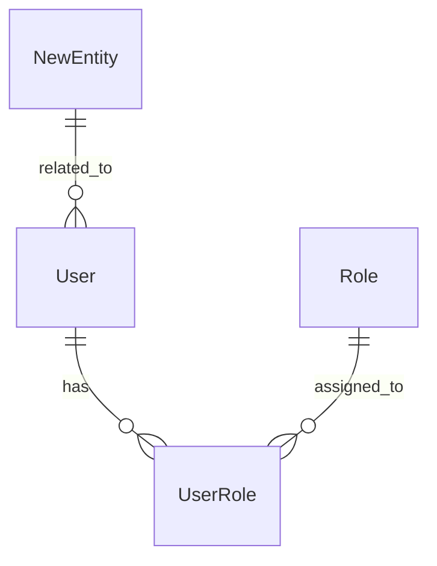

# Documentation Maintenance Guide

## Overview

This guide explains how to request documentation updates and how to maintain documentation as the MakanNegarSaba project evolves. Documentation should be kept up-to-date with code changes to ensure accuracy and usefulness.

---

## How to Request Documentation Updates

### Quick Request Format

When requesting documentation updates, use one of these formats:

1. **"Update [document type] for [feature/change]"**
   - Example: "Update API docs for new endpoint `/api/Substation/GetById`"
   - Example: "Update ER diagram after adding new table `MaintenanceLog`"

2. **"Add [content] to [document]"**
   - Example: "Add user story for map export feature"
   - Example: "Add new endpoint to API documentation"

3. **"Regenerate [document type]"**
   - Example: "Regenerate API docs after endpoint changes"
   - Example: "Regenerate ER diagram from database"

4. **"Create [new document] for [topic]"**
   - Example: "Create ADR for choosing PDF library"
   - Example: "Create deployment guide for Linux server"

### Detailed Request Format

For complex changes, provide more details:

```
Update Request:
- Document: [Document name and path]
- Change: [What needs to be changed]
- Reason: [Why the change is needed]
- Related Code: [File paths or commit references]
- Additional Context: [Any other relevant information]
```

---

## Documentation Types and Update Procedures

### 1. API Endpoint Documentation

**Location**: `docs/api/endpoints.md`

#### When to Update
- New endpoint added
- Endpoint modified (parameters, response format)
- Endpoint removed
- Authentication requirements changed

#### How to Request Update
- **Simple**: "Update API docs - added endpoint `POST /api/Substation`"
- **Detailed**: Provide endpoint details (method, path, parameters, response)

#### Automated Updates
- API documentation can be auto-generated from Swagger/OpenAPI
- Run: `dotnet swagger` to generate OpenAPI spec
- Swagger UI available at `/swagger` endpoint

#### Manual Updates
If automated generation is not available:
1. Locate endpoint in controller file
2. Document method, route, parameters, response
3. Add example request/response
4. Update authentication requirements if changed

---

### 2. ER Diagram

**Location**: `docs/database/er-diagram.md`

#### When to Update
- New entity/table added
- Entity relationships changed
- New fields added to entities
- Tables removed or renamed

#### How to Request Update
- **Simple**: "Update ER diagram - added table `MaintenanceLog`"
- **Detailed**: Provide entity details and relationships

#### Automated Updates
ER diagram can be generated from Entity Framework migrations:
1. Review latest migrations
2. Update Mermaid diagram in markdown
3. Regenerate PNG if needed

#### Manual Updates
1. Identify new/modified entities in `BargContext.cs`
2. Review entity relationships in configuration files
3. Update Mermaid diagram syntax
4. Update entity descriptions
5. Update relationship descriptions

**Example Mermaid Syntax**:


---

### 3. User Stories

**Location**: `docs/user-stories/user-stories.md`

#### When to Update
- New feature implemented
- Feature requirements changed
- New user persona identified
- Epic scope changed

#### How to Request Update
- **Simple**: "Add user story for map export feature"
- **Detailed**: Provide story details (persona, goal, acceptance criteria)

#### Update Format
Follow existing user story format:
- Story ID (US-X.Y)
- Persona and goal
- Acceptance criteria
- Priority and story points
- Dependencies

---

### 4. User Journey Maps

**Location**: `docs/user-journey-maps/`

#### When to Update
- New user workflow added
- Existing workflow changed significantly
- New persona identified
- User experience improved

#### How to Request Update
- **Simple**: "Update power manager journey - added export step"
- **Detailed**: Describe workflow changes

#### Update Procedure
1. Identify affected journey map file
2. Update Mermaid journey diagram
3. Update detailed journey steps
4. Update emotional journey graph
5. Update success criteria if needed

---

### 5. Software Requirements Specification (SRS)

**Location**: `docs/srs/srs.md`

#### When to Update
- New functional requirement added
- Requirement changed
- Non-functional requirement updated
- System architecture changed

#### How to Request Update
- **Simple**: "Update SRS - added requirement REQ-MAP-004 for map export"
- **Detailed**: Provide requirement details

#### Update Format
Follow existing requirement format:
- Requirement ID (REQ-XXX-###)
- Priority
- Description
- Functional requirements
- Inputs/Outputs
- Acceptance criteria

---

### 6. Statement of Work (SOW)

**Location**: `docs/sow.md`

#### When to Update
- Project scope changed
- Timeline adjusted
- Deliverables modified
- Resources changed

#### How to Request Update
- **Simple**: "Update SOW - extended timeline by 2 weeks"
- **Detailed**: Describe scope/timeline changes

**Note**: SOW updates typically require formal approval process.

---

### 7. Change Request Documentation

**Location**: `docs/change-requests/`

#### When to Create
- Any change to scope, timeline, or deliverables
- Significant feature additions
- Architecture changes
- Technology stack changes

#### How to Create
1. Copy `template.md`
2. Fill in all sections
3. Submit for approval
4. Track implementation status
5. Close when complete

---

## Automated Documentation Generation

### API Documentation (Swagger/OpenAPI)

The API documentation can be automatically generated from code:

1. **Generate OpenAPI Spec**:
   ```bash
   dotnet run --project src/IRI.App/Barg/Presentation/IRI.App.MakanNegarSaba.Api
   # Visit http://localhost:{port}/swagger
   ```

2. **Export OpenAPI JSON**:
   - Access `/swagger/v1/swagger.json`
   - Save to `docs/api/openapi.json`

3. **Generate Markdown from OpenAPI**:
   - Use tools like `swagger-markdown` or `redoc-cli`
   - Or manually update `docs/api/endpoints.md`

### ER Diagram Generation

While fully automated ER diagram generation from EF Core is complex, you can:

1. **Review Migrations**:
   ```bash
   dotnet ef migrations list --project src/IRI.App/Barg/Infrastructure/IRI.App.MakanNegarSaba.Ef
   ```

2. **Inspect Database Schema**:
   - Use SQL Server Management Studio
   - Generate database diagram
   - Export as image

3. **Update Mermaid Diagram**:
   - Review `BargContext.cs` for DbSet properties
   - Review entity configuration files
   - Update Mermaid syntax in `er-diagram.md`

---

## Manual Documentation Updates

### Step-by-Step Process

1. **Identify What Changed**
   - Review code changes (git diff)
   - Identify affected documentation

2. **Update Documentation**
   - Edit relevant markdown files
   - Update diagrams if needed
   - Maintain consistent formatting

3. **Review Changes**
   - Check for accuracy
   - Verify completeness
   - Ensure consistency

4. **Commit Changes**
   - Commit documentation with code changes
   - Or create separate documentation commit
   - Include clear commit message

### Documentation Standards

- **Markdown Format**: Use standard Markdown syntax
- **Mermaid Diagrams**: For ER diagrams and journey maps
- **Code Blocks**: Use syntax highlighting
- **Links**: Use relative paths for internal links
- **Consistency**: Follow existing document structure

---

## Common Update Scenarios

### Scenario 1: New API Endpoint Added

**Request**: "Update API docs - added `GET /api/Substation/{id}` endpoint"

**Steps**:
1. Locate new endpoint in controller
2. Add endpoint documentation to `docs/api/endpoints.md`
3. Include method, path, parameters, response format
4. Add example request/response
5. Update authentication requirements if needed

---

### Scenario 2: New Database Table Added

**Request**: "Update ER diagram - added `MaintenanceLog` table"

**Steps**:
1. Review new entity in `Core/Entities/`
2. Review entity configuration
3. Add entity to Mermaid diagram
4. Add entity description
5. Document relationships
6. Update entity list in documentation

---

### Scenario 3: New Feature Implemented

**Request**: "Add user story and update SRS for map export feature"

**Steps**:
1. Add user story to `docs/user-stories/user-stories.md`
2. Add requirement to `docs/srs/srs.md`
3. Update relevant user journey map if workflow changed
4. Update API docs if new endpoints added
5. Update user manual if user-facing feature

---

### Scenario 4: Architecture Decision Made

**Request**: "Create ADR for choosing PDF library for map export"

**Steps**:
1. Create new ADR file in `docs/adr/`
2. Follow ADR template
3. Document decision, context, consequences
4. Link from relevant documentation

---

## Documentation Review Process

### Before Committing

1. **Accuracy Check**
   - Verify information matches code
   - Check for typos and errors
   - Ensure examples work

2. **Completeness Check**
   - All sections filled
   - No TODO comments
   - All links work

3. **Consistency Check**
   - Formatting consistent
   - Terminology consistent
   - Style matches existing docs

### Peer Review

- Request review from team members
- Address feedback
- Update documentation accordingly

---

## Version Control

### Documentation in Git

- Documentation is version-controlled in Git
- Commit documentation changes with code changes
- Use descriptive commit messages
- Tag releases with documentation updates

### Commit Message Format

```
docs: [type] [brief description]

[Detailed description if needed]

Related: #[issue-number]
```

Examples:
- `docs: api Add endpoint documentation for Substation GetById`
- `docs: database Update ER diagram with MaintenanceLog table`
- `docs: user-stories Add story for map export feature`

---

## Documentation Tools

### Recommended Tools

- **Markdown Editor**: VS Code, Typora, or any markdown editor
- **Diagram Tools**: 
  - Mermaid (for ER diagrams, journey maps)
  - Draw.io (for complex diagrams)
  - PlantUML (alternative to Mermaid)
- **API Documentation**: Swagger/OpenAPI
- **PDF Generation**: For formal documents (if needed)

### VS Code Extensions

- Markdown Preview Enhanced
- Mermaid Preview
- Markdown All in One
- Spell Right (for spell checking)

---

## Getting Help

### Questions About Documentation

- Check this maintenance guide first
- Review existing documentation for examples
- Ask in team chat or documentation channel
- Contact documentation maintainer

### Reporting Documentation Issues

- Create issue in project tracker
- Tag as "documentation"
- Provide details about what's wrong
- Suggest corrections if possible

---

## Best Practices

1. **Update Documentation with Code**
   - Don't let documentation lag behind code
   - Update docs as you write code
   - Include documentation in code reviews

2. **Keep It Simple**
   - Write clearly and concisely
   - Use examples
   - Avoid jargon when possible

3. **Maintain Consistency**
   - Follow existing formats
   - Use consistent terminology
   - Keep style uniform

4. **Review Regularly**
   - Periodically review documentation
   - Remove outdated information
   - Update examples

5. **Make It Accessible**
   - Use clear headings
   - Add table of contents for long documents
   - Include cross-references

---

## Quick Reference

### Common Commands

```bash
# View API documentation
# Start API and visit http://localhost:{port}/swagger

# List database migrations
dotnet ef migrations list --project src/IRI.App/Barg/Infrastructure/IRI.App.MakanNegarSaba.Ef

# Generate database script
dotnet ef migrations script --project src/IRI.App/Barg/Infrastructure/IRI.App.MakanNegarSaba.Ef
```

### Documentation File Locations

- API Docs: `docs/api/endpoints.md`
- ER Diagram: `docs/database/er-diagram.md`
- User Stories: `docs/user-stories/user-stories.md`
- User Journeys: `docs/user-journey-maps/`
- SRS: `docs/srs/srs.md`
- SOW: `docs/sow.md`
- CR Template: `docs/change-requests/template.md`
- ADRs: `docs/adr/`

---

## Summary

This maintenance guide provides:

1. ✅ How to request documentation updates
2. ✅ Procedures for updating each document type
3. ✅ Automated vs. manual update processes
4. ✅ Common scenarios and solutions
5. ✅ Best practices and standards

**Remember**: Good documentation is a living document that evolves with the project. Keep it updated, accurate, and useful!

---

**Last Updated**: 2024  
**Maintained By**: Documentation Team

