# Entity Relationship Diagram - MakanNegarSaba Database

## Overview

This document describes the Entity Relationship (ER) diagram for the MakanNegarSaba database. The database stores spatial and non-spatial data related to electrical infrastructure management for the Barg Regional Power Company.

## Database Schema

### Entity Relationship Diagram (Mermaid)

```mermaid
erDiagram
    %% User Management Entities
    User ||--o{ UserRole : "has"
    User ||--o{ UserLogin : "logs"
    User ||--o| User : "assigned_by"
    Role ||--o{ UserRole : "assigned_to"
    Role ||--o{ RolePermission : "has"
    
    %% Spatial Data Entities - Substations
    Substat {
        int Id PK
        geometry SHAPE
        int OBJECTID
        string gis_id
        string subst_code
        string subf_name
        string sube_name
        string max_vol
        string sub_kind
        string estab_type
        double sul_curcap
        string address
        string tel_num
    }
    
    AppSubstation {
        int Id PK
        geometry SHAPE
        int OBJECTID
        string gis_id
        string subst_code
        string subf_name
    }
    
    UnConSubstation {
        int Id PK
        geometry SHAPE
        int OBJECTID
        string gis_id
        string subf_name
    }
    
    Busbar {
        int Id PK
        geometry SHAPE
        int OBJECTID
        string gis_id
        string disp_code
        string subst_code
    }
    
    PowTran {
        int Id PK
        geometry SHAPE
        int OBJECTID
        string gis_id
        string disp_code
        string subst_code
        double nomi_cap
    }
    
    CondBeeq {
        int Id PK
        geometry SHAPE
        int OBJECTID
        string gis_id
        string subst_code
    }
    
    SwitchyardArea {
        int Id PK
        geometry SHAPE
        int OBJECTID
        string gis_id
        string switchy_vol
        string subst_code
    }
    
    %% Transmission Line Entities
    TrLineSeg {
        int Id PK
        geometry SHAPE
        int OBJECTID
        string gis_id
        string line_name
        string path_name
        short denomi_vol
        short cir_num
        string path_type
        double path_length
    }
    
    UnConTrLine {
        int Id PK
        geometry SHAPE
        int OBJECTID
        string gis_id
        string path_name
        short denomi_vol
    }
    
    Circuit {
        int Id PK
        geometry SHAPE
        int OBJECTID
        string gis_id
        string cir_name
        string line_name
    }
    
    OvciSeg {
        int Id PK
        geometry SHAPE
        int OBJECTID
        string gis_id
        string circuit_disp
    }
    
    Tower {
        int Id PK
        geometry SHAPE
        int OBJECTID
        string gis_id
        string towpl_num
        string line_name
        short tow_type
    }
    
    %% Power Station Entities
    PowerPlant {
        int Id PK
        geometry SHAPE
        int OBJECTID
        string gis_id
        string plant_name
        string plant_type
        double installed_capacity
    }
    
    DgPowerPlant {
        int Id PK
        geometry SHAPE
        int OBJECTID
        string gis_id
        string plant_name
        double capacity
    }
    
    %% Communication Entities
    OpticFi {
        int Id PK
        geometry SHAPE
        int OBJECTID
        string gis_id
        string fibre_kind
        short fibre_num
        string path_type
    }
    
    JoinBox {
        int Id PK
        geometry SHAPE
        int OBJECTID
        string gis_id
        string box_type
    }
    
    ComTowr {
        int Id PK
        geometry SHAPE
        int OBJECTID
        string gis_id
        string tow_type
    }
    
    %% Settings
    LayerSetting {
        int Id PK
        string Title
        string TableName
        bool IsActive
        int MinLayerZoomLevel
        int MaxLayerZoomLevel
        string HexFill
        string HexStroke
        double StrokeThickness
        double Opacity
        bool IsLayerOn
        string ServiceUrl
        bool IsGroupLayer
        int GroupLayerId
        bool IsSearchable
        bool IsLabeled
        string LabelColumn
        int MapOrder
        int LegendOrder
    }
    
    %% User Management
    User {
        int Id PK
        string EmailAddress UK
        string FirstName
        string LastName
        DateTime RegistrationTime
        string PasswordHash
        string ShareCode
        bool IsEmailVerified
        DateTime VerifyTime
        bool IsActive
        bool IsLocked
        DateTime LockedUntil
        int FailedLoginAttempts
        DateTime LastLoginAt
        byte Thumbnail
        Guid Stamp
    }
    
    Role {
        int Id PK
        string Name UK
        string DisplayName
        string Description
        bool IsSystemRole
        bool IsActive
        DateTime CreatedAt
        DateTime UpdatedAt
    }
    
    UserRole {
        int Id PK
        int UserId FK
        int RoleId FK
        DateTime AssignedAt
        int AssignedByUserId FK
        DateTime ExpiresAt
    }
    
    RolePermission {
        int Id PK
        int RoleId FK
        int PermissionId
        DateTime GrantedAt
    }
    
    UserLogin {
        int Id PK
        int UserId FK
        DateTime LoginAt
        string IpAddress
        string UserAgent
    }
```

## Entity Descriptions

### User Management Entities

#### User
Stores user account information including authentication credentials, profile data, and account status.

**Key Fields:**
- `Id`: Primary key
- `EmailAddress`: Unique email address (used for login)
- `PasswordHash`: MD5 hash of password with stamp
- `IsActive`: Account activation status
- `IsLocked`: Account lock status (for failed login attempts)
- `IsEmailVerified`: Email verification status

#### Role
Defines user roles in the system (e.g., SuperAdmin, Admin, Manager, User, Viewer).

**Key Fields:**
- `Id`: Primary key
- `Name`: Unique role name (e.g., "SuperAdmin")
- `DisplayName`: Human-readable role name
- `IsSystemRole`: Indicates if role is system-defined (cannot be deleted)

#### UserRole
Junction table for many-to-many relationship between Users and Roles. Supports role expiration.

**Key Fields:**
- `UserId`: Foreign key to User
- `RoleId`: Foreign key to Role
- `AssignedByUserId`: User who assigned this role
- `ExpiresAt`: Optional expiration date for temporary role assignments

#### RolePermission
Junction table linking Roles to Permissions. Defines what actions each role can perform.

**Key Fields:**
- `RoleId`: Foreign key to Role
- `PermissionId`: Integer representing Permission enum value

#### UserLogin
Audit log of user login attempts and sessions.

**Key Fields:**
- `UserId`: Foreign key to User
- `LoginAt`: Timestamp of login
- `IpAddress`: IP address of login
- `UserAgent`: Browser/client information

### Spatial Data Entities

#### Substation Entities

**Substat** (Substation)
Main entity for transmission and distribution substations. Contains comprehensive operational and technical data.

**AppSubstation** (Approved Substation)
Substations that have been approved but not yet constructed.

**UnConSubstation** (Under Construction Substation)
Substations currently under construction.

**Busbar**
Busbar equipment within substations.

**PowTran** (Power Transformer)
Power transformers located in substations.

**CondBeeq** (Conductor Between Equipment)
Conductors connecting equipment within substations.

**SwitchyardArea**
Switchyard areas within substations.

#### Transmission Line Entities

**TrLineSeg** (Transmission Line Segment)
Segments of transmission lines with detailed technical specifications.

**UnConTrLine** (Under Construction Transmission Line)
Transmission lines currently under construction.

**Circuit**
Electrical circuits on transmission lines.

**OvciSeg** (Overhead Circuit Segment)
Overhead circuit segments.

**Tower**
Transmission line towers/poles.

#### Power Station Entities

**PowerPlant**
Main power generation plants.

**DgPowerPlant** (Distributed Generation Power Plant)
Distributed generation power plants.

#### Communication Entities

**OpticFi** (Optical Fiber)
Optical fiber communication infrastructure.

**JoinBox**
Fiber optic junction boxes.

**ComTowr** (Communication Tower)
Communication towers.

### Configuration Entities

#### LayerSetting
Configuration for map layers including styling, visibility, zoom levels, and labeling.

**Key Fields:**
- `TableName`: Database table name for the layer
- `ServiceUrl`: API endpoint for layer data
- `IsGroupLayer`: Indicates if this is a group/container layer
- `GroupLayerId`: Parent group layer ID
- `MinLayerZoomLevel` / `MaxLayerZoomLevel`: Zoom level visibility range
- `HexFill` / `HexStroke`: Color styling
- `IsSearchable`: Whether layer can be searched
- `IsLabeled`: Whether layer displays labels

## Relationships

### User Management Relationships

1. **User ↔ UserRole ↔ Role**: Many-to-Many
   - A user can have multiple roles
   - A role can be assigned to multiple users
   - UserRole junction table includes assignment metadata

2. **Role ↔ RolePermission**: One-to-Many
   - A role has many permissions
   - Each permission assignment is tracked with timestamp

3. **User ↔ UserLogin**: One-to-Many
   - A user can have multiple login records
   - Used for audit and statistics

4. **User → User (AssignedBy)**: Self-referencing
   - Tracks which user assigned roles to other users

### Spatial Data Relationships

Spatial entities are primarily independent with relationships implied through:
- Common `gis_id` fields (not enforced as foreign keys)
- Common `subst_code` fields linking substation equipment
- Common `line_name` fields linking transmission line components
- Geographic/spatial relationships handled by GIS geometry fields

### Layer Settings Relationships

**LayerSetting → LayerSetting (GroupLayerId)**: Self-referencing
- Supports hierarchical layer grouping
- Group layers contain multiple sub-layers

## Spatial Data

All spatial entities include a `SHAPE` field of type `Geometry` (NetTopologySuite) that stores:
- **Points**: For towers, power plants, substations
- **LineStrings**: For transmission lines, circuits, optical fiber
- **Polygons**: For substation areas, switchyard areas

The spatial reference system used is Web Mercator (EPSG:3857).

## Indexes

### Primary Keys
- All entities have `Id` as primary key (int)

### Unique Indexes
- `User.EmailAddress`: Unique email constraint
- `Role.Name`: Unique role name constraint
- `UserRole(UserId, RoleId)`: Unique user-role assignment
- `RolePermission(RoleId, PermissionId)`: Unique role-permission assignment

### Foreign Key Indexes
- `UserRole.UserId` → `User.Id`
- `UserRole.RoleId` → `Role.Id`
- `RolePermission.RoleId` → `Role.Id`
- `UserLogin.UserId` → `User.Id`

## Notes

1. **Spatial Data**: All infrastructure entities include geometry data for GIS visualization
2. **Audit Fields**: User entities include created/updated timestamps and user tracking
3. **Soft Deletes**: Some entities may use `IsActive` flags instead of hard deletes
4. **Permission System**: Permissions are stored as enum integers in RolePermission table
5. **Layer Configuration**: LayerSetting provides runtime configuration for map display without requiring code changes

