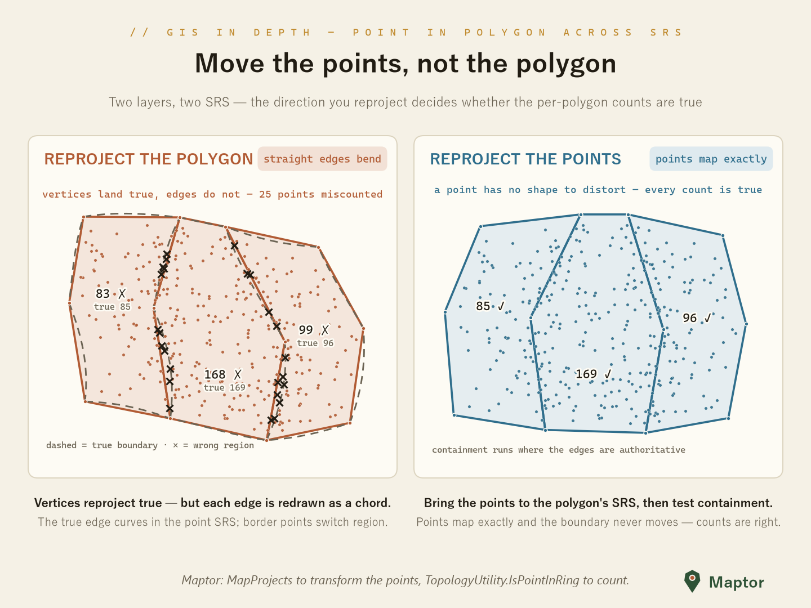

# Point-in-polygon across SRS — move the points, not the polygon

A knowledge-base entry on a subtle but consequential GIS mistake: how to count
points per polygon (point-in-polygon, spatial join, containment filter) when the
point layer and the polygon layer are stored in **different spatial reference
systems**, and why the *direction* of reprojection decides whether the counts
are true.

> **The rule that ties this whole doc together**
> Always run the containment test in the **polygon layer's SRS**: reproject the
> **point layer** into the polygon's SRS, never the polygon into the point's.
> A point reprojects exactly; a polygon does not.

---

## The mistake ordinary software makes

Given a point layer in SRS A and a polygon layer in SRS B, many tools (and many
hand-written scripts) reconcile the mismatch by transforming the **polygon
layer** into the point layer's SRS and then running point-in-polygon or
intersect there. It is a tempting optimization: the polygon layer usually has a
handful of features with a few hundred vertices, while the point layer may have
millions of rows — transforming the polygons is far cheaper.

Cheap, and wrong.

## Why it is wrong

A polygon is stored as **vertices plus implied straight edges**. Reprojection
transforms only the vertices; the software then redraws each edge as a straight
chord between the transformed vertices in the target SRS.

But a straight line in one SRS is **not** a straight line in another. Any
non-linear coordinate transform — geographic to projected, or between two
different projections — maps a straight segment to a **curve**. The redrawn
chord therefore deviates from the true boundary image, so the reprojected
polygon covers a slightly different region than the real one:

- the deviation is zero at the vertices and largest at the **middle of each
  edge**;
- it grows with **edge length** (long, sparse edges are the worst case) and
  with the **curvature of the transform** in that area.

Every point sitting in the sliver between the chord and the true curve is then
assigned to the **wrong polygon** — exactly the near-border points a count is
most sensitive to.

## Why moving the points is right

A point is dimensionless: it has no edges to redraw. Reprojection maps one
coordinate pair to one coordinate pair, exactly (up to negligible numeric
error). Transforming the point layer into the polygon's SRS distorts nothing,
and the containment test then runs against the polygon **where its edges are
authoritative** — the SRS its geometry was authored in.

## Demonstration

The image (generated by
[`brand/social/generators/docs_point_in_polygon_srs.py`](../../brand/social/generators/docs_point_in_polygon_srs.py),
which also documents the simulated transform) shows three polygon regions with
long shared borders and 350 points:

- **Left card — reproject the polygon**: everything is pushed into the point
  layer's SRS. Vertices land true, but the solid chord edges drift off the
  dashed true boundary, and 25 points (the × marks) are counted in the wrong
  region.
- **Right card — reproject the points**: the same data in the polygon's SRS;
  edges are straight and authoritative, every point maps exactly, all counts
  are true.

Note a treacherous detail visible in the left card's labels: although 25
individual points are misassigned, the per-region totals barely move (83 vs 85,
168 vs 169, 99 vs 96) because flips across each border go in **both directions
and largely cancel**. Aggregate counts can look plausible while the individual
answers are wrong — so a "the totals look fine" spot-check will not catch this
bug.

## Nuances and edge cases

- **If you truly must move the polygon** (for example you need it in the other
  SRS anyway), **densify** its edges first — insert intermediate vertices along
  each segment — and then reproject. This bounds the chord error but is still
  an approximation; moving the points is exact.
- **The one exception**: if the two SRS are related by a purely **affine**
  transform, straight lines stay straight and either direction works. In
  practice any projection change is non-linear, so treat the rule as universal.
- **Authoritativeness**: the result is correct *with respect to the SRS the
  polygon was authored in*. If a boundary is legally defined by geodesics on
  the ellipsoid rather than by its stored projected geometry, the authoritative
  form is the geodesic one — the rule generalizes to "test containment where
  the boundary definition is authoritative".
- **Performance**: transforming millions of points costs more than transforming
  a few polygons — that is the whole temptation. The cost is linear and
  parallelizable; correctness is worth it.

## Doing it in Maptor

Transform the point layer with the projection/transform APIs in
`IRI.Maptor.Sta.SpatialReferenceSystem` (`MapProjects`, with SRIDs via
`SridHelper`), then count with the point-in-ring predicates in
`IRI.Maptor.Sta.Spatial` (`TopologyUtility.IsPointInRing` or
`TopologyUtility.IsPointInRingUsingSignedAngles`) — in the polygon's SRS.

## Related

- [Analysis topics in IRI.Maptor.Sta.Spatial](../../src/IRI.Maptor.Sta/IRI.Maptor.Sta.Spatial/Analysis/README.md)
  — the point-in-polygon predicates themselves (ray casting vs winding number).
- [Map projections in IRI.Maptor.Sta.SpatialReferenceSystem](../../src/IRI.Maptor.Sta/IRI.Maptor.Sta.SpatialReferenceSystem/MapProjections/README.md)
  — the transforms that move the points.
