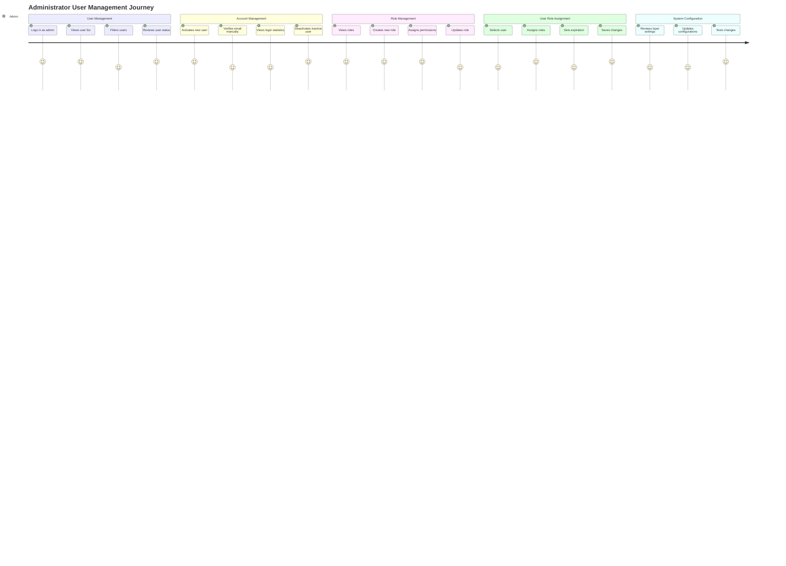

# User Journey Map: System Administrator

## Persona
**Name**: System Administrator  
**Role**: IT administrator managing users, roles, and system configuration  
**Goal**: Manage user accounts, configure permissions, maintain system security

## Journey Overview



## Detailed Journey Steps

### Phase 1: User Management (Weekly, Monday Morning)

**Touchpoint**: WPF Application - User Management View  
**Emotion**: Organized, Methodical  
**Actions**:
1. Administrator logs in with admin credentials
2. Administrator navigates to User Management section
3. Administrator views list of all users
4. Administrator filters users by:
   - Active/Inactive status
   - Email verification status
   - Registration date range
5. Administrator reviews user accounts:
   - New registrations requiring activation
   - Users with unverified emails
   - Inactive users who may need deactivation

**Pain Points**:
- Large user list might be slow to load
- No bulk operations available
- Filtering options might be limited

**Opportunities**:
- Pagination for large lists
- Bulk activate/deactivate
- Advanced filtering options
- Export user list to CSV

**Technical Details**:
- API endpoint: `GET /api/User?activeOnly=false`
- Returns list of UserDto objects
- Requires admin permissions

---

### Phase 2: Account Activation (As Needed)

**Touchpoint**: User Management - Account Details  
**Emotion**: Careful, Responsible  
**Actions**:
1. Administrator selects new user from list
2. Administrator reviews user information:
   - Email address
   - Registration date
   - Email verification status
   - Account status
3. Administrator verifies user identity (external process)
4. Administrator activates account:
   - Sets `IsActive = true`
   - Manually verifies email if needed
5. Administrator assigns initial role(s)
6. Administrator notifies user (external process)

**Pain Points**:
- Manual verification process is time-consuming
- No workflow for approval process
- No audit trail of activation decisions

**Opportunities**:
- Approval workflow with comments
- Email notification to user upon activation
- Audit log of all account changes
- Bulk activation for multiple users

**Technical Details**:
- API endpoint: `PUT /api/User/{userId}/status`
- API endpoint: `PUT /api/User/{userId}/verify-email`
- Changes logged in database

---

### Phase 3: Role Management (Monthly or As Needed)

**Touchpoint**: Role Management Interface  
**Emotion**: Strategic, Planning  
**Actions**:
1. Administrator navigates to Role Management
2. Administrator views existing roles:
   - System roles (cannot be deleted)
   - Custom roles
   - Role permissions
   - Users assigned to each role
3. Administrator creates new role:
   - Enters role name and display name
   - Adds description
   - Selects permissions from list
4. Administrator reviews permission categories:
   - User Management
   - Role Management
   - Substations
   - Transmission Lines
   - Power Stations
   - Communications
   - Layer Settings
   - Reports
5. Administrator assigns permissions to role
6. Administrator saves role

**Pain Points**:
- Permission list might be long
- No way to test role before assigning
- Cannot copy existing role as template

**Opportunities**:
- Permission search/filter
- Role templates
- Copy role functionality
- Permission dependency checking
- Test role in sandbox

**Technical Details**:
- API endpoint: `GET /api/Permission/grouped`
- API endpoint: `POST /api/Role`
- Permissions stored as enum integers

---

### Phase 4: User Role Assignment (Weekly)

**Touchpoint**: User Role Assignment Interface  
**Emotion**: Efficient, Organized  
**Actions**:
1. Administrator selects user from list
2. Administrator views current role assignments
3. Administrator reviews user's permissions
4. Administrator assigns new roles:
   - Selects roles from available list
   - Sets optional expiration date
   - Reviews permission changes
5. Administrator removes outdated roles
6. Administrator saves changes
7. System updates user permissions immediately

**Pain Points**:
- Cannot see permission changes before saving
- No bulk role assignment
- Role expiration might be forgotten

**Opportunities**:
- Preview permission changes
- Bulk role assignment
- Role assignment templates
- Expiration reminders
- Role assignment history

**Technical Details**:
- API endpoint: `POST /api/User/{userId}/roles/sync`
- Replaces all role assignments
- Tracks assigned by and timestamp

---

### Phase 5: Monitoring & Maintenance (Daily/Weekly)

**Touchpoint**: User Statistics & Reports  
**Emotion**: Vigilant, Analytical  
**Actions**:
1. Administrator reviews user login statistics:
   - First login dates
   - Last login dates
   - Login counts
   - Failed login attempts
2. Administrator identifies inactive users
3. Administrator reviews security events:
   - Account lockouts
   - Failed login attempts
   - Unusual access patterns
4. Administrator takes action:
   - Deactivates inactive accounts
   - Resets locked accounts
   - Investigates suspicious activity

**Pain Points**:
- Statistics scattered across different views
- No automated alerts
- Manual review is time-consuming

**Opportunities**:
- Dashboard with key metrics
- Automated alerts for suspicious activity
- Scheduled reports
- User activity analytics
- Security audit log

**Technical Details**:
- API endpoint: `GET /api/User/{userId}/login-statistics`
- UserLogin table tracks all logins
- Failed attempts tracked in User table

---

### Phase 6: System Configuration (Monthly)

**Touchpoint**: Layer Settings Management  
**Emotion**: Technical, Careful  
**Actions**:
1. Administrator reviews layer settings
2. Administrator updates layer configurations:
   - Visibility settings
   - Styling (colors, stroke thickness)
   - Zoom level ranges
   - Label settings
3. Administrator tests changes on map
4. Administrator saves configuration
5. Changes reflected immediately for all users

**Pain Points**:
- No preview before saving
- Changes affect all users immediately
- No version control for settings

**Opportunities**:
- Preview changes before applying
- Staging environment for testing
- Version history for settings
- Rollback capability
- User-specific layer overrides

**Technical Details**:
- Layer settings stored in database
- API endpoint: `GET /LayerSetting/List`
- Settings loaded on application startup

---

## Emotional Journey

```
Emotion Level
    5 |  ╭─╮     ╭─╮     ╭─╮
      |  ╱ ╲     ╱ ╲     ╱ ╲
    4 | ╱   ╲   ╱   ╲   ╱   ╲
      |╱     ╲ ╱     ╲ ╱     ╲
    3 |       ╱       ╱       ╲
      |      ╱       ╱         ╲
    2 |     ╱       ╱           ╲
      └────────────────────────────
       User Role User Monitoring Config
       Mgmt  Mgmt Role
```

## Key Metrics

- **User Management Frequency**: Weekly
- **New User Activations**: 5-20 per week
- **Role Management**: Monthly or as needed
- **Average Time per User**: 2-5 minutes
- **System Configuration**: Monthly

## Success Criteria

Administrator journey is successful when:
1. ✅ Administrator can efficiently manage user accounts
2. ✅ Administrator can create and configure roles
3. ✅ Administrator can assign appropriate permissions
4. ✅ Administrator can monitor user activity
5. ✅ Administrator can maintain system security
6. ✅ Administrator can configure system settings

## Improvement Opportunities

1. **Workflow Automation**: Automated approval workflows
2. **Bulk Operations**: Bulk user and role management
3. **Audit Trail**: Comprehensive audit logging
4. **Reporting**: User activity and security reports
5. **Templates**: Role and permission templates
6. **Self-Service**: User self-service for password reset
7. **Integration**: Integration with Active Directory/LDAP
8. **Notifications**: Automated notifications for admin tasks

## Security Considerations

- All admin actions should be logged
- Two-factor authentication for admin accounts
- Session timeout for admin sessions
- IP whitelisting for admin access (optional)
- Regular security audits
- Permission change notifications

