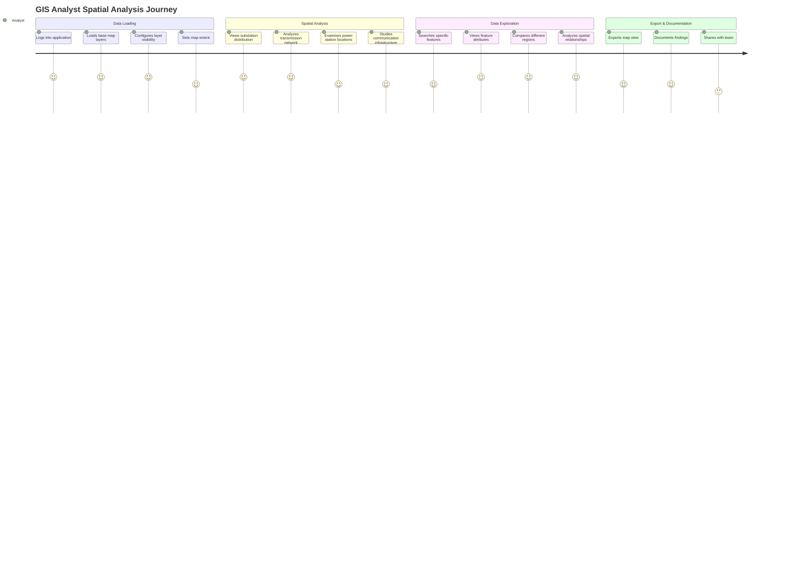

# User Journey Map: GIS Analyst

## Persona
**Name**: GIS Analyst  
**Role**: Geographic Information Systems specialist analyzing spatial data  
**Goal**: Analyze power infrastructure, create maps, export data for analysis

## Journey Overview



## Detailed Journey Steps

### Phase 1: Data Loading (Session Start)

**Touchpoint**: WPF Application - Map Interface  
**Emotion**: Focused, Analytical  
**Actions**:
1. GIS Analyst logs into application
2. Main map window opens
3. Analyst configures initial view:
   - Sets geographic extent (region of interest)
   - Adjusts zoom level
   - Selects base map style
4. Analyst loads required layers:
   - Substations layer
   - Transmission lines layer
   - Power stations layer
   - Communication infrastructure (if needed)
5. Analyst adjusts layer visibility:
   - Shows/hides specific layer groups
   - Sets layer opacity
   - Configures label visibility

**Pain Points**:
- Too many layers loaded at once slows performance
- Layer order might not be optimal
- Need to reconfigure every session

**Opportunities**:
- Save layer configurations
- Preset layer combinations
- Performance optimization for many layers
- Layer presets for common analysis types

**Technical Details**:
- Layer settings loaded from `/LayerSetting/List`
- Features loaded via spatial endpoints
- GeoJSON format for interoperability

---

### Phase 2: Spatial Analysis (Core Work)

**Touchpoint**: Interactive Map Analysis  
**Emotion**: Engaged, Problem-solving  
**Actions**:
1. **Substation Distribution Analysis**:
   - Analyst views all substations in region
   - Analyst identifies clusters and gaps
   - Analyst analyzes voltage level distribution
   - Analyst examines capacity distribution

2. **Transmission Network Analysis**:
   - Analyst views transmission line network
   - Analyst identifies network topology
   - Analyst analyzes line capacities
   - Analyst examines circuit configurations
   - Analyst studies tower distribution

3. **Power Station Analysis**:
   - Analyst views power generation facilities
   - Analyst analyzes generation capacity distribution
   - Analyst studies relationship to load centers
   - Analyst examines distributed generation

4. **Communication Infrastructure**:
   - Analyst views optical fiber routes
   - Analyst examines communication tower locations
   - Analyst analyzes coverage areas

**Pain Points**:
- Cannot easily measure distances
- No buffer/overlay analysis tools
- Cannot create custom queries
- Limited spatial analysis tools

**Opportunities**:
- Measurement tools (distance, area)
- Buffer analysis
- Spatial queries (within, intersects)
- Custom filtering by attributes
- Heat maps and density analysis

**Technical Details**:
- Spatial data in Web Mercator projection
- Geometry types: Point, LineString, Polygon
- Features include spatial and attribute data

---

### Phase 3: Data Exploration (Deep Dive)

**Touchpoint**: Feature Details & Search  
**Emotion**: Curious, Investigative  
**Actions**:
1. Analyst uses search to find specific features:
   - Searches by name
   - Searches by GIS ID
   - Searches by location
2. Analyst views feature attributes:
   - Clicks on feature to view details
   - Reviews all attribute fields
   - Notes important information
3. Analyst compares features:
   - Views multiple features side-by-side
   - Compares attributes
   - Analyzes differences
4. Analyst studies spatial relationships:
   - Examines proximity
   - Analyzes connectivity
   - Studies coverage areas

**Pain Points**:
- Search might be slow
- Cannot select multiple features easily
- Details panel covers map
- No attribute table view

**Opportunities**:
- Advanced search with multiple criteria
- Multi-select functionality
- Attribute table view
- Comparison tool
- Spatial selection tools

**Technical Details**:
- Search endpoint: `/api/Search/GeneralSearch`
- Pagination for large result sets
- Feature details from spatial endpoints

---

### Phase 4: Export & Documentation (Session End)

**Touchpoint**: Export & Sharing  
**Emotion**: Satisfied, Accomplished  
**Actions**:
1. Analyst prepares final map view:
   - Adjusts zoom to show area of interest
   - Configures layer visibility
   - Ensures labels are readable
2. Analyst exports map (if feature available):
   - Saves as image
   - Exports as PDF
   - Includes legend and scale
3. Analyst documents findings:
   - Takes notes (external tool)
   - Creates report (external tool)
   - Includes map images
4. Analyst shares with team:
   - Sends via email
   - Uploads to shared drive
   - Presents in meeting

**Pain Points**:
- No built-in export functionality
- Cannot add annotations to map
- No report generation
- Manual process for documentation

**Opportunities**:
- Export map as image/PDF
- Annotation tools
- Report generation
- Share map views directly
- Print layout options

---

## Emotional Journey

```
Emotion Level
    5 |  ╭─╮     ╭─╮     ╭─╮
      |  ╱ ╲     ╱ ╲     ╱ ╲
    4 | ╱   ╲   ╱   ╲   ╱   ╲
      |╱     ╲ ╱     ╲ ╱     ╲
    3 |       ╱       ╱       ╲
      |      ╱       ╱         ╲
    2 |     ╱       ╱           ╲
      └────────────────────────────
       Load  Analysis Explore Export
       Data
```

## Key Metrics

- **Session Duration**: 1-3 hours
- **Layers Loaded**: 5-15 per session
- **Features Analyzed**: 50-200 per session
- **Search Queries**: 10-30 per session
- **Map Exports**: 2-5 per session

## Success Criteria

GIS Analyst journey is successful when:
1. ✅ Analyst can load required spatial data efficiently
2. ✅ Analyst can perform spatial analysis
3. ✅ Analyst can explore feature attributes
4. ✅ Analyst can identify spatial patterns
5. ✅ Analyst can document findings
6. ✅ Analyst can share results with team

## Improvement Opportunities

1. **Advanced Spatial Analysis**:
   - Buffer analysis
   - Overlay operations
   - Network analysis
   - Proximity analysis

2. **Data Export**:
   - Export to Shapefile
   - Export to GeoJSON
   - Export to KML
   - Export attribute tables to CSV

3. **Visualization**:
   - Thematic mapping
   - Heat maps
   - Density analysis
   - Custom symbology

4. **Measurement Tools**:
   - Distance measurement
   - Area measurement
   - Coordinate display
   - Bearing/direction

5. **Annotation**:
   - Draw on map
   - Add text labels
   - Add markers
   - Save annotations

6. **Custom Queries**:
   - SQL-like queries
   - Spatial queries
   - Attribute filtering
   - Save query templates

7. **Integration**:
   - Import external data
   - Connect to external GIS services
   - Export to GIS software
   - API access for automation

## Technical Requirements

- **Performance**: Fast rendering with many features
- **Accuracy**: Precise spatial data
- **Interoperability**: Standard formats (GeoJSON, WKT)
- **Scalability**: Handle large datasets
- **Projection Support**: Multiple coordinate systems

