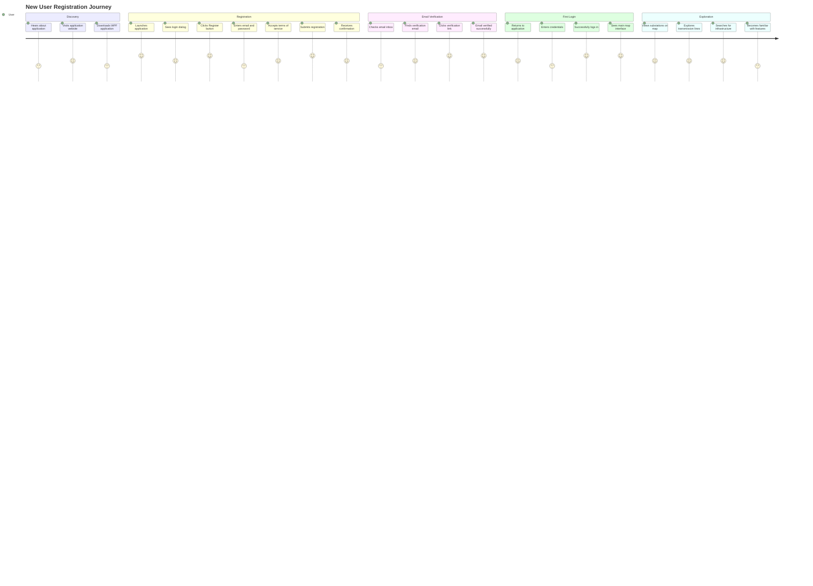

# User Journey Map: New User Registration

## Persona
**Name**: New User  
**Role**: First-time user registering for MakanNegarSaba  
**Goal**: Create an account and start using the GIS application

## Journey Overview



## Detailed Journey Steps

### Phase 1: Discovery (Days 1-2)

**Touchpoint**: Colleague recommendation / Email announcement  
**Emotion**: Curious, Interested  
**Actions**:
- User hears about MakanNegarSaba from colleague or receives announcement
- User visits application website or documentation
- User downloads WPF application installer

**Pain Points**:
- May not know where to download the application
- Installation process might be unclear

**Opportunities**:
- Provide clear download instructions
- Include installation guide

---

### Phase 2: Registration (Day 2)

**Touchpoint**: WPF Application - Login Dialog  
**Emotion**: Excited, Slightly anxious  
**Actions**:
1. User launches WPF application
2. Application shows login dialog with registration option
3. User clicks "ثبت نام" (Register) button
4. User enters:
   - Email address
   - Password (twice for confirmation)
5. User checks "Accept Terms of Service" checkbox
6. User clicks submit button
7. Application shows confirmation message

**Pain Points**:
- Password requirements not clearly visible
- Email format validation happens after submission
- Terms of service link might not work

**Opportunities**:
- Show password requirements upfront
- Real-time email validation
- Ensure terms of service link is accessible

**Technical Details**:
- Registration request is encrypted using RSA
- Server validates email uniqueness
- Server creates user account with `IsActive = false`
- Server sends verification email

---

### Phase 3: Email Verification (Day 2-3)

**Touchpoint**: Email Client  
**Emotion**: Impatient, Checking frequently  
**Actions**:
1. User checks email inbox
2. User finds verification email from MakanNegarSaba
3. User clicks verification link in email
4. Browser opens verification page
5. System verifies token and activates account
6. User sees success message

**Pain Points**:
- Email might go to spam folder
- Verification link might expire
- User might not understand what to do

**Opportunities**:
- Clear email subject and content
- Instructions in email
- Link expiration notice
- Resend verification option

**Technical Details**:
- Verification token is time-limited
- Token is single-use
- Account `IsEmailVerified` set to `true`
- Account `IsActive` may remain `false` until admin approval

---

### Phase 4: First Login (Day 3)

**Touchpoint**: WPF Application - Login Dialog  
**Emotion**: Relieved, Excited  
**Actions**:
1. User returns to application
2. User enters email and password
3. User clicks "ورود" (Login) button
4. System validates credentials
5. System checks email verification status
6. System checks account active status
7. System issues JWT token
8. Application stores token
9. Main window opens with map interface

**Pain Points**:
- If email not verified, user sees error and is confused
- If account not activated, user cannot proceed
- Token storage might fail silently

**Opportunities**:
- Clear error messages explaining next steps
- Link to resend verification email
- Contact admin information

**Technical Details**:
- Login request encrypted with RSA
- Password validated against hash
- JWT token issued with user claims
- Token stored in application settings
- Failed login attempts tracked

---

### Phase 5: Exploration (Day 3+)

**Touchpoint**: WPF Application - Main Map Interface  
**Emotion**: Curious, Learning  
**Actions**:
1. User sees map with default view (Iran provinces)
2. User zooms in to see substations
3. User clicks on substation to see details
4. User toggles transmission line layer
5. User searches for specific infrastructure
6. User explores different zoom levels
7. User becomes familiar with interface

**Pain Points**:
- Map might be slow to load initially
- Too many layers visible at once
- Not sure what features are available

**Opportunities**:
- Welcome tutorial or tooltips
- Default layer visibility optimized
- Quick start guide
- Sample searches suggested

**Technical Details**:
- Map loads base tiles
- Layer settings loaded from API
- Features loaded based on zoom level
- Search functionality available

---

## Emotional Journey

```
Emotion Level
    5 |                    ╭─╮
      |                   ╱   ╲
    4 |          ╭─╮    ╱     ╲
      |         ╱   ╲  ╱       ╲
    3 |    ╭─╮ ╱     ╲╱         ╲
      |   ╱   ╱                   ╲
    2 |  ╱   ╱                     ╲
      | ╱   ╱                       ╲
    1 |╱   ╱                         ╲
      └───────────────────────────────
       Discovery Reg Email First Explore
                  Verif Login
```

## Key Metrics

- **Time to Registration**: 5-10 minutes
- **Time to Email Verification**: 1-24 hours (depends on user)
- **Time to First Login**: 1-2 days
- **Time to First Successful Use**: 2-3 days

## Success Criteria

User journey is successful when:
1. ✅ User successfully registers account
2. ✅ User verifies email within 24 hours
3. ✅ User logs in successfully
4. ✅ User views at least one map layer
5. ✅ User performs at least one search

## Improvement Opportunities

1. **Streamline Registration**: Reduce steps, add progress indicator
2. **Faster Verification**: Consider SMS verification option
3. **Onboarding**: Add interactive tutorial for first-time users
4. **Help System**: Contextual help and tooltips throughout
5. **Feedback Loop**: Collect user feedback after first week

