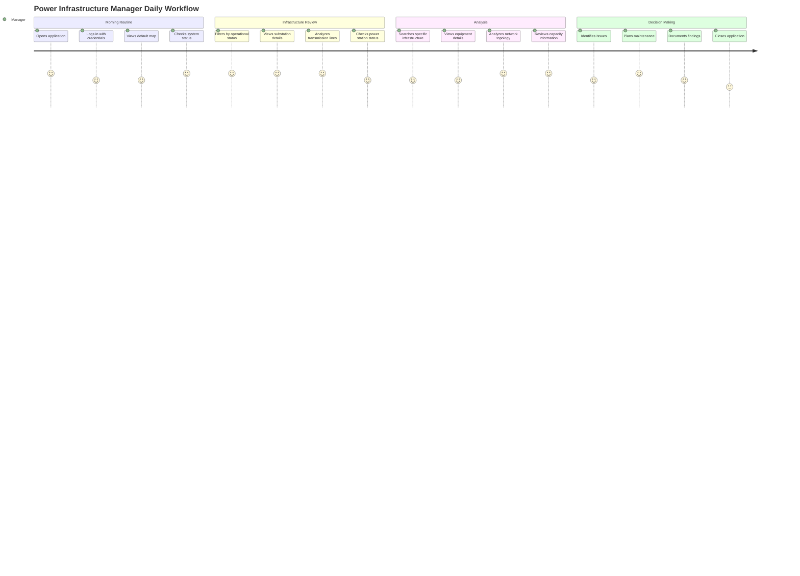

# User Journey Map: Power Infrastructure Manager

## Persona
**Name**: Power Infrastructure Manager  
**Role**: Manager responsible for power grid operations  
**Goal**: Monitor infrastructure, analyze network, make operational decisions

## Journey Overview



## Detailed Journey Steps

### Phase 1: Morning Routine (Daily, 8:00 AM)

**Touchpoint**: WPF Application Launch  
**Emotion**: Focused, Ready to work  
**Actions**:
1. Manager launches MakanNegarSaba application
2. Application shows login dialog
3. Manager enters email and password
4. System authenticates and issues token
5. Main window opens with map
6. Manager sees default view (last used or default region)

**Pain Points**:
- Slow application startup
- Need to re-enter credentials if token expired
- Map takes time to load

**Opportunities**:
- Remember last map view
- Faster startup time
- Background token refresh

---

### Phase 2: Infrastructure Review (8:15 AM - 9:00 AM)

**Touchpoint**: Map Interface - Layer Controls  
**Emotion**: Analytical, Observant  
**Actions**:
1. Manager toggles substation layer ON
2. Manager filters to show only operational substations
3. Manager zooms to region of interest
4. Manager clicks on substation to view details
5. Manager reviews:
   - Substation name and location
   - Voltage levels
   - Current capacity
   - Operational status
   - Contact information
6. Manager toggles transmission line layer ON
7. Manager views transmission network
8. Manager checks power station status

**Pain Points**:
- Too many layers visible at once
- Details panel might cover map
- Need to click multiple times to get full information

**Opportunities**:
- Quick filter presets
- Collapsible details panel
- Hover tooltips with key info
- Layer grouping for easier management

**Technical Details**:
- API calls: `/Substation/ListSubstat`, `/TransmissionLine/ListTrLineSeg`
- Data filtered by operational status
- Features loaded based on zoom level
- GeoJSON format for spatial data

---

### Phase 3: Analysis (9:00 AM - 10:30 AM)

**Touchpoint**: Search and Detail Views  
**Emotion**: Focused, Problem-solving  
**Actions**:
1. Manager uses search to find specific substation
2. Manager views search results
3. Manager clicks result to navigate to location
4. Manager views substation equipment:
   - Power transformers
   - Busbars
   - Switchyard areas
5. Manager analyzes transmission line segments:
   - Line capacity
   - Number of circuits
   - Tower information
6. Manager reviews capacity vs. load data
7. Manager identifies potential bottlenecks

**Pain Points**:
- Search might be slow with large datasets
- Equipment details scattered across multiple clicks
- No easy way to compare multiple substations

**Opportunities**:
- Advanced search filters
- Comparison view for multiple assets
- Export functionality for reports
- Historical data visualization

**Technical Details**:
- Search endpoint: `/api/Search/GeneralSearch`
- Equipment endpoints: `/Substation/ListPowTran`, `/Substation/ListBusbar`
- Pagination for large result sets

---

### Phase 4: Decision Making (10:30 AM - 11:00 AM)

**Touchpoint**: Analysis and Documentation  
**Emotion**: Decisive, Confident  
**Actions**:
1. Manager identifies infrastructure issues:
   - Overloaded substations
   - Transmission line capacity concerns
   - Equipment needing maintenance
2. Manager plans actions:
   - Schedule maintenance
   - Plan capacity upgrades
   - Coordinate with teams
3. Manager documents findings:
   - Takes notes (external tool)
   - May export map view (if available)
   - Shares information with team

**Pain Points**:
- No built-in note-taking
- Cannot export map views
- No collaboration features
- Information scattered

**Opportunities**:
- Integrated note-taking
- Export map as image/PDF
- Share views with team
- Annotation tools on map

---

### Phase 5: Ongoing Monitoring (Throughout Day)

**Touchpoint**: Periodic Checks  
**Emotion**: Vigilant, Responsive  
**Actions**:
1. Manager periodically checks application
2. Manager views updated infrastructure status
3. Manager monitors for changes
4. Manager responds to alerts (if system has alerts)

**Pain Points**:
- No real-time updates
- Manual refresh required
- No notification system

**Opportunities**:
- Auto-refresh functionality
- Real-time updates via WebSocket
- Notification system for changes
- Dashboard view with key metrics

---

## Emotional Journey

```
Emotion Level
    5 |        ╭─╮     ╭─╮
      |       ╱ ╲     ╱ ╲
    4 |  ╭─╮╱   ╲   ╱   ╲
      |  ╱ ╱     ╲ ╱     ╲
    3 | ╱ ╱       ╱       ╲
      |╱ ╱                 ╲
    2 |╱                     ╲
      └───────────────────────
       Login Review Analysis Decision Monitor
```

## Key Metrics

- **Daily Login Frequency**: 3-5 times
- **Average Session Duration**: 30-60 minutes
- **Infrastructure Items Reviewed**: 20-50 per session
- **Search Queries**: 5-15 per session
- **Time to Find Information**: 2-5 minutes average

## Success Criteria

Manager journey is successful when:
1. ✅ Manager can quickly access needed information
2. ✅ Manager can analyze infrastructure effectively
3. ✅ Manager can make informed decisions
4. ✅ Manager can document findings
5. ✅ Application supports daily workflow efficiently

## Improvement Opportunities

1. **Performance**: Faster map rendering and data loading
2. **Workflow**: Customizable dashboard for quick access
3. **Analysis Tools**: Built-in analysis and comparison tools
4. **Collaboration**: Share views and annotations with team
5. **Reporting**: Export capabilities for documentation
6. **Alerts**: Notification system for important changes
7. **Mobile Access**: Mobile app for on-the-go access

## Power User Features Needed

- **Custom Views**: Save and load custom map configurations
- **Bookmarks**: Save frequently accessed locations
- **History**: View recently accessed infrastructure
- **Shortcuts**: Keyboard shortcuts for common actions
- **Batch Operations**: Select and analyze multiple items at once

