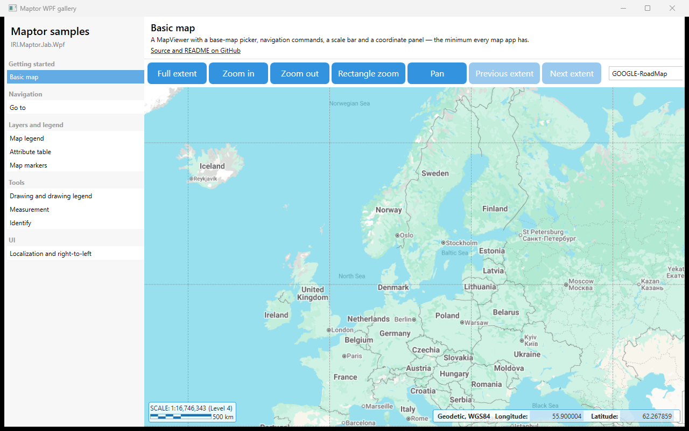

# IRI.Maptor.Samples.Wpf.Gallery

One window, one page per `IRI.Maptor.Presentation.Wpf` feature. The navigation list on the left is built
from `Shell/SampleCatalog.cs`; each page is a `UserControl` in its own folder under `Samples/`,
with a README that explains it and links to the source.



## Samples

| Page | Folder | Shows |
|---|---|---|
| Basic map | [Samples/BasicMap](Samples/BasicMap/README.md) | Navigation commands, base-map picker, `Scalebar`, `CoordinatePanelView` |
| Go to | [Samples/GoTo](Samples/GoTo/README.md) | `GoToCommand` dialog and `GoToView` hosted inline |
| Map legend | [Samples/MapLegend](Samples/MapLegend/README.md) | `MapLegendView`, in-memory `VectorLayer`, add shapefile / GeoJSON |
| Attribute table | [Samples/AttributeTable](Samples/AttributeTable/README.md) | `FeatureTabControl`, `SelectedLayer`, opening a table from code |
| Map markers | [Samples/MapMarkers](Samples/MapMarkers/README.md) | `SpecialPointLayer`, `Locateable`, built-in markers, a custom command |
| Drawing and drawing legend | [Samples/DrawingLegend](Samples/DrawingLegend/README.md) | Draw commands, `MapDrawingLegendView`, `SketchBarView` |
| Measurement | [Samples/Measurement](Samples/Measurement/README.md) | `MeasureLengthCommand`, `MeasureAreaCommand` |
| Identify | [Samples/Identify](Samples/Identify/README.md) | `IdentifyModeCommand`, Identify results window |
| Delaunay and Voronoi | [Samples/DelaunayVoronoi](Samples/DelaunayVoronoi/README.md) | `DelaunayTriangulation`, `VoronoiDiagram`, clipping unbounded cells |
| Theme and controls | [Samples/ThemeAndControls](Samples/ThemeAndControls/README.md) | Every design-system token over a live accent + light/dark switch; `ThemeHelper`, `FollowWindowsMode` |
| Localization and right-to-left | [Samples/Localization](Samples/Localization/README.md) | `LanguageCombo`, `LocalizationManager` bindings, `FlowDirection` |

## How a page is built

Every page is a `UserControl` that owns its own `MapViewer` and initializes it in `Loaded`,
exactly like [HelloMap](../IRI.Maptor.Samples.Wpf.HelloMap/README.md) does in its window:

```csharp
var presenter = new GalleryMapViewModel();                         // empty MapViewModelBase subclass
presenter.InitializeSettings(ProxySettings.Default, BaseMapSettings.Default,
    new MapSettings { InitialExtent = BoundingBoxes.WebMercator_Europe }, GeneralSettings.Default);
await MapInitializationHelper.InitializeMapAsync(map, Window.GetWindow(this)!, presenter);
DataContext = presenter;
presenter.SelectedMapProvider = TileMapProviderFactory.GoogleRoadMap;
```

The shell (`MainWindow`, `Shell/`) only lists pages and hosts the selected one; a page never
references the shell, so a sample folder can be copied into your own application as is. The one
shared file is `Shell/GalleryMapViewModel.cs` — three lines — used by the pages that need no
commands of their own.

## How to run

```bash
dotnet run --project samples/IRI.Maptor.Samples.Wpf.Gallery
```

## Adding a page

1. Create `Samples/<Name>/<Name>Sample.xaml` (+ `.xaml.cs`) and `Samples/<Name>/README.md`.
2. Add one `new(...)` line to `Shell/SampleCatalog.cs` with the category, title, description and folder.

---
[Back to the samples index](../README.md)
