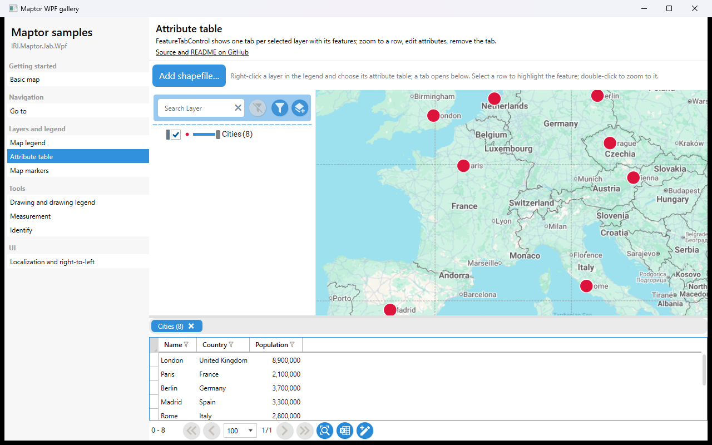

# Attribute table

`FeatureTabControl` shows one tab per entry in the view model's `SelectedLayers` collection, each tab a grid of the layer's features. Selecting a row highlights the feature, double-click zooms to it. The sample opens the table of its in-memory *Cities* layer on start — the same thing the legend's *show attributes* command does — and lets you add a shapefile to see more.



## What it shows

- `FeatureTabControl` with `CanUserEditGeometry`, `CanUserEditAttribute`, `IsZoomToGeometryEnabled`.
- A point layer with attributes, built from `Feature<Point>` + `MemoryDataSource`; `SimplePointSymbolizer` sets the marker size.
- Opening a layer's table from code: `layer.GetFeaturesAsync()` → `new SelectedLayer(...)` → `presenter.AddSelectedLayer(...)`.

## The essential code

```csharp
var features = await layer.GetFeaturesAsync();

var selected = new SelectedLayer(presenter.DialogService, layer, layer.GetFields());
selected.Features = new ObservableCollection<Feature<Point>>(features.Features);

await presenter.AddSelectedLayer(selected);      // a tab appears in FeatureTabControl
```

## How to run

```bash
dotnet run --project samples/IRI.Maptor.Samples.Wpf.Gallery
```

then pick **Attribute table** in the list. Source: [`AttributeTableSample.xaml`](AttributeTableSample.xaml),
[`AttributeTableSample.xaml.cs`](AttributeTableSample.xaml.cs).

---
[Back to the gallery](../../README.md) · [Samples index](../../../README.md)
