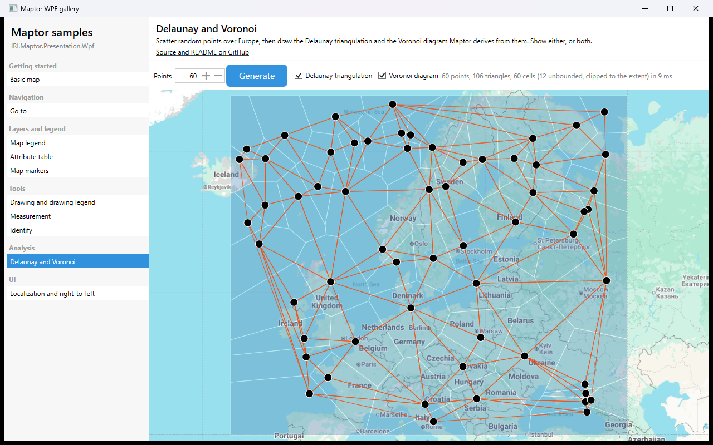

# Delaunay and Voronoi

Pick a number of points, press **Generate**, and the sample scatters that many random points over
Europe and draws the two structures Maptor derives from them: the Delaunay triangulation, and the
Voronoi diagram that is its dual. Either can be switched off, so the same point set can be looked at
both ways. Regenerating a few thousand points takes a few milliseconds.



## What it shows

- `DelaunayTriangulation.Create(points)` — the triangulation, with counter-clockwise vertex triples
  and neighbour links (`TriangleIndices.NeighbourAB`, `…BC`, `…CA`).
- `triangulation.GetVoronoiDiagram()` — the dual: `Vertices[i]` is the circumcentre of `Triangles[i]`,
  `Cells` gives one cell per site and `Edges` the bisectors between neighbouring sites.
- Closing the unbounded cells: sites on the convex hull have `Cell.IsClosed == false` and two
  infinite rays (`Edge.IsRay`), which the sample runs out and clips so the diagram tiles the extent.
- Building `VectorLayer`s from in-memory `Feature<Point>` objects, and toggling layers with
  `ILayer.IsVisible` instead of rebuilding them.

## The essential code

The computation is two calls; everything else is presentation.

```csharp
var triangulation = DelaunayTriangulation.Create(points);

var voronoi = triangulation.GetVoronoiDiagram();

// one polygon per triangle
for (int i = 0; i < triangulation.Triangles.Count; i++)
{
    var t = triangulation.Triangles[i];

    var geometry = Geometry<Point>.CreatePolygon(
        [triangulation.Points[t.A], triangulation.Points[t.B], triangulation.Points[t.C]],
        SridHelper.WebMercator);
}

// one polygon per cell: the circumcentres around the site, counter-clockwise
foreach (var cell in voronoi.Cells)
{
    var ring = cell.VertexIndices.Select(i => voronoi.Vertices[i]).ToList();
}
```

## Two things worth knowing

**Both algorithms are planar.** They work on the coordinates you give them, with no notion of a
sphere, so the points must already be projected. The sample generates them directly in Web Mercator
— the map's own reference system — rather than in longitude and latitude, where "halfway between two
points" would not mean what the algorithms assume. That is also why the areas in the attribute table
are labelled as map units: Web Mercator exaggerates area as latitude grows.

**Cells on the hull are unbounded.** A site on the convex hull has no neighbour on one side, so its
cell runs to infinity: `Cell.IsClosed` is false and the two open sides appear in `Edges` as rays
(`VertexB == -1`, with a unit direction). To draw them as polygons the sample extends each ray to a
rectangle large enough to contain every circumcentre, walks that rectangle's perimeter between the
two exit points — picking up any corners on the way, or a corner cell would be cut across — and then
clips the result back to the generation extent with Sutherland-Hodgman, which is valid here because
Voronoi cells are always convex. The finished cells cover the extent exactly, with no gaps.

All of that lives in [`DelaunayVoronoiBuilder.cs`](DelaunayVoronoiBuilder.cs), which has no WPF in
it: it takes a point count and an extent and returns three lists of features.

## Try this

- Generate with 3 points: one triangle, three cells, all of them unbounded.
- Turn the triangulation off and watch the cells alone — every cell contains exactly one point, and
  the point in it is the nearest one to every position inside it.
- Turn the cells off and open the triangles in the attribute table (the **Attribute table** sample):
  each carries its smallest angle. No other triangulation of the same points has a larger minimum
  angle — that is the property Delaunay is defined by, and it is why the triangles look so even.

## How to run

```bash
dotnet run --project samples/IRI.Maptor.Samples.Wpf.Gallery
```

then pick **Delaunay and Voronoi** in the list. Source:
[`DelaunayVoronoiSample.xaml`](DelaunayVoronoiSample.xaml),
[`DelaunayVoronoiSample.xaml.cs`](DelaunayVoronoiSample.xaml.cs),
[`DelaunayVoronoiBuilder.cs`](DelaunayVoronoiBuilder.cs).

---
[Back to the gallery](../../README.md) · [Samples index](../../../README.md)
