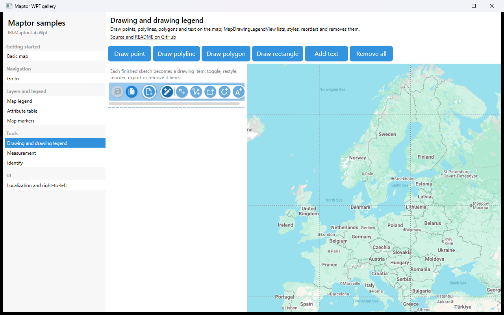

# Drawing and drawing legend

Draw points, polylines, polygons, rectangles and text on the map. Each finished sketch becomes a *drawing item*; `MapDrawingLegendView` lists them and lets the user toggle, restyle, reorder, export or remove them. `SketchBarView` floats over the map while a sketch is in progress with finish / finish-part / cancel.



## What it shows

- `DrawPointCommand`, `DrawPolylineCommand`, `DrawPolygonCommand`, `DrawRectangleCommand`, `AddTextToMapCommand`, `RemoveAllDrawingItemsCommand`.
- `MapDrawingLegendView` — bound through the inherited `DataContext`, no extra wiring.
- `SketchBarView` with `DataContext="{Binding}"`.
- The same commands are the entry point for `GetDrawingAsync`, if you need the drawn geometry in code.

## The essential code

```xml
<Button Content="Draw polygon" Command="{Binding DrawPolygonCommand}" />

<maptor:MapDrawingLegendView />

<Grid>
    <maptor:MapViewer x:Name="map" MapAction="{Binding MapAction, Mode=OneWay}" />
    <maptor:SketchBarView DataContext="{Binding}" />
</Grid>
```

## How to run

```bash
dotnet run --project samples/IRI.Maptor.Samples.Wpf.Gallery
```

then pick **Drawing and drawing legend** in the list. Source: [`DrawingLegendSample.xaml`](DrawingLegendSample.xaml),
[`DrawingLegendSample.xaml.cs`](DrawingLegendSample.xaml.cs).

---
[Back to the gallery](../../README.md) · [Samples index](../../../README.md)
