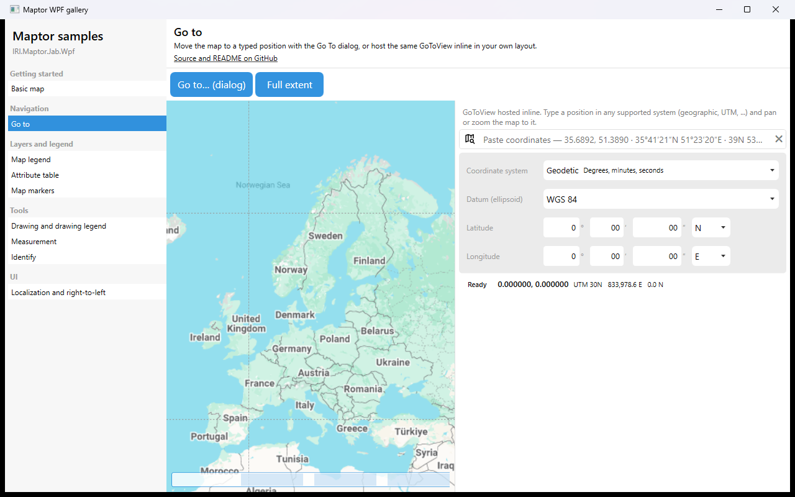

# Go to

Move the map to a typed position. The **Go to… (dialog)** button runs `GoToCommand`, which opens `GoToMetroWindow` through the default action wired by `MapInitializationHelper`. The panel on the right hosts the same `GoToView` inline, to show that the dialog is just a window around a reusable control.



## What it shows

- `GoToCommand` → `RequestShowGoToView` → `GoToMetroWindow`, pre-filled with the map centre.
- `GoToView` as an ordinary `UserControl` with a `GoToViewModel` as its `DataContext`.
- `GoToViewModel.Create(presenter)` — binds the view model's pan / zoom / add-point requests to a map view model.
- Input in geographic (decimal or DMS), UTM and projected systems, with a quick-entry box that parses pasted coordinates.

## The essential code

```csharp
// the dialog: already wired; just bind a button
<Button Content="Go to…" Command="{Binding GoToCommand}" />

// the same view inline
<maptor:GoToView x:Name="inlineGoTo" />

inlineGoTo.DataContext = GoToViewModel.Create(presenter);
```

## How to run

```bash
dotnet run --project samples/IRI.Maptor.Samples.Wpf.Gallery
```

then pick **Go to** in the list. Source: [`GoToSample.xaml`](GoToSample.xaml),
[`GoToSample.xaml.cs`](GoToSample.xaml.cs).

---
[Back to the gallery](../../README.md) · [Samples index](../../../README.md)
