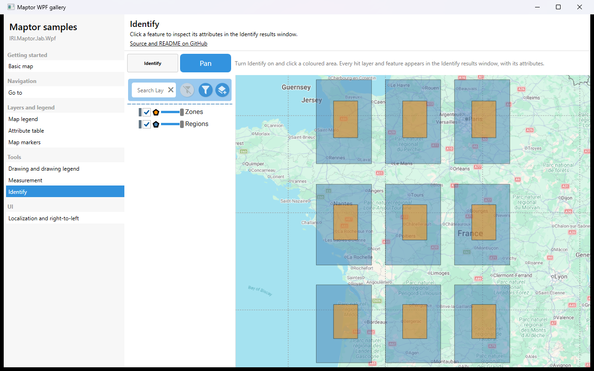

# Identify

Turn **Identify** on and click a feature: every layer hit at that point, and every feature in it, appears in the modeless *Identify results* window with its attributes. The sample adds two overlapping polygon layers so that one click hits features in both.



## What it shows

- `IdentifyModeCommand` toggles `MapAction` between `Identify` and `Pan`; `IsIdentifyMode` drives the toggle button.
- The Identify results window lives in the library and is wired by `MapViewer` — nothing to add in the app.
- Two in-memory `VectorLayer`s with attributes, built exactly as in the [Map legend](../MapLegend/README.md) sample.

## The essential code

```xml
<ToggleButton Content="Identify"
              Command="{Binding IdentifyModeCommand}"
              IsChecked="{Binding IsIdentifyMode, Mode=OneWay}" />

<maptor:MapViewer x:Name="map" MapAction="{Binding MapAction, Mode=OneWay}" />
```

## How to run

```bash
dotnet run --project samples/IRI.Maptor.Samples.Wpf.Gallery
```

then pick **Identify** in the list. Source: [`IdentifySample.xaml`](IdentifySample.xaml),
[`IdentifySample.xaml.cs`](IdentifySample.xaml.cs).

---
[Back to the gallery](../../README.md) · [Samples index](../../../README.md)
