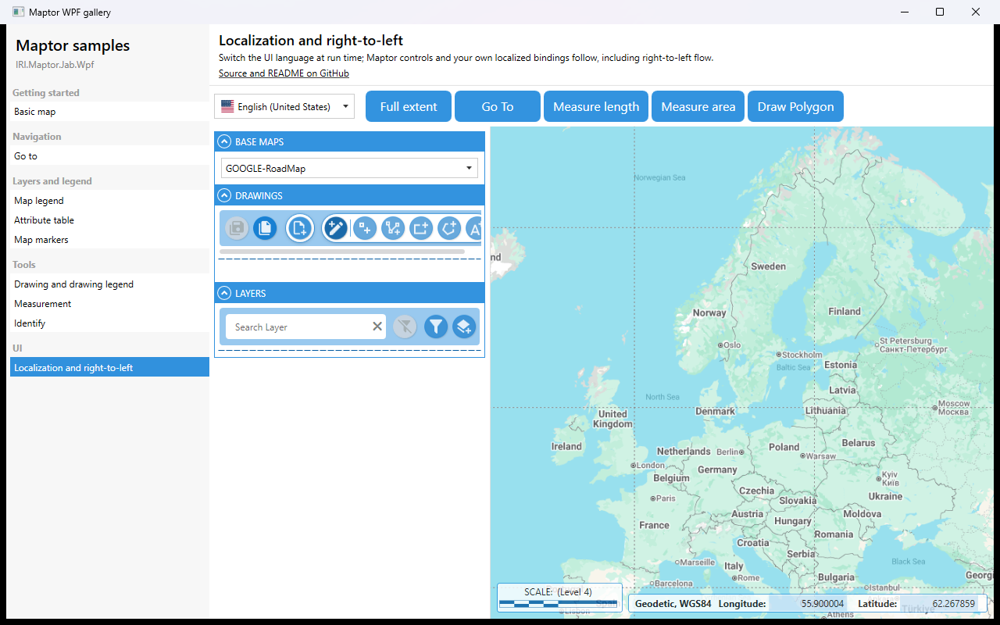

# Localization and right-to-left

Switch the UI language at run time. `LocalizationManager` is a process-wide singleton: the Maptor controls read their strings from it, and your own XAML can bind to its indexer. Right-to-left cultures (Persian, Arabic, ...) flip the whole layout through one `FlowDirection` binding at the root.



## What it shows

- `LanguageCombo` with a `LanguageSelectorViewModel` — flags, native names, and `SetCulture` on change.
- `{Binding [cmd_general_goTo], Source={StaticResource Localization}}` — a localized string by resource key.
- `FlowDirection="{Binding CurrentFlowDirection, Source={StaticResource Localization}}"`.
- Maptor's own controls (legend, drawing legend, sketch bar, coordinate panel) switching along.

## The essential code

```xml
<UserControl.Resources>
    <ObjectDataProvider x:Key="Localization"
                        ObjectInstance="{x:Static localization:LocalizationManager.Instance}" />
</UserControl.Resources>

<DockPanel FlowDirection="{Binding CurrentFlowDirection, Source={StaticResource Localization}}">
    <maptor:LanguageCombo x:Name="languageCombo" />
    <Button Content="{Binding [cmd_general_goTo], Source={StaticResource Localization}}"
            Command="{Binding GoToCommand}" />
</DockPanel>
```

## How to run

```bash
dotnet run --project samples/IRI.Maptor.Samples.Wpf.Gallery
```

then pick **Localization and right-to-left** in the list. Source: [`LocalizationSample.xaml`](LocalizationSample.xaml),
[`LocalizationSample.xaml.cs`](LocalizationSample.xaml.cs).

---
[Back to the gallery](../../README.md) · [Samples index](../../../README.md)
