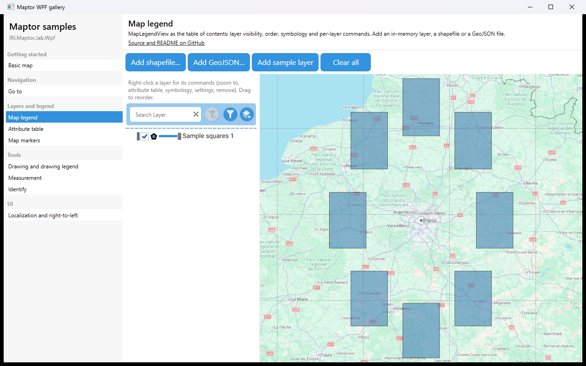

# Map legend

`MapLegendView` is the table of contents: it lists the layers, toggles visibility, shows the symbology swatch and offers per-layer commands (zoom to, attribute table, symbology, settings, remove). The sample adds an in-memory polygon layer on start; the buttons add more of them, or load a shapefile / GeoJSON file through the built-in commands.



## What it shows

- `MapLegendView` bound to the view model's `LegendViewModel`.
- Building a `VectorLayer` from in-memory `Feature<Point>` objects via `MemoryDataSource`.
- Geometries created in WGS 84 with `Geometry<Point>.CreatePolygon` and projected with `.Project(SrsBases.WebMercator)`.
- `VisualParameters` for fill / stroke / opacity; `AddLayer` and `ZoomToExtent`.
- `AddShapefileCommand`, `AddGeoJSONfileCommand`, `ClearAllCommand`.

## The essential code

```csharp
var polygon = Geometry<Point>.CreatePolygon(ring, SridHelper.GeodeticWGS84).Project(SrsBases.WebMercator);

features.Add(new Feature<Point>(polygon, new Dictionary<string, object> { ["Name"] = "Square 1" }));

var layer = new VectorLayer(
    layerName: "Sample squares",
    dataSource: new MemoryDataSource(features),
    parameters: new VisualParameters(fill: Colors.SteelBlue, stroke: Colors.Black, strokeThickness: 1, opacity: 0.6),
    type: LayerType.VectorLayer,
    renderMode: RenderMode.Default,
    rasterizationMethod: RasterizationMethod.DrawingVisual,
    visibleRange: ScaleInterval.All);

presenter.AddLayer(layer);
presenter.ZoomToExtent(layer.Extent, isExactExtent: false, isNewExtent: true);
```

## How to run

```bash
dotnet run --project samples/IRI.Maptor.Samples.Wpf.Gallery
```

then pick **Map legend** in the list. Source: [`MapLegendSample.xaml`](MapLegendSample.xaml),
[`MapLegendSample.xaml.cs`](MapLegendSample.xaml.cs).

---
[Back to the gallery](../../README.md) · [Samples index](../../../README.md)
