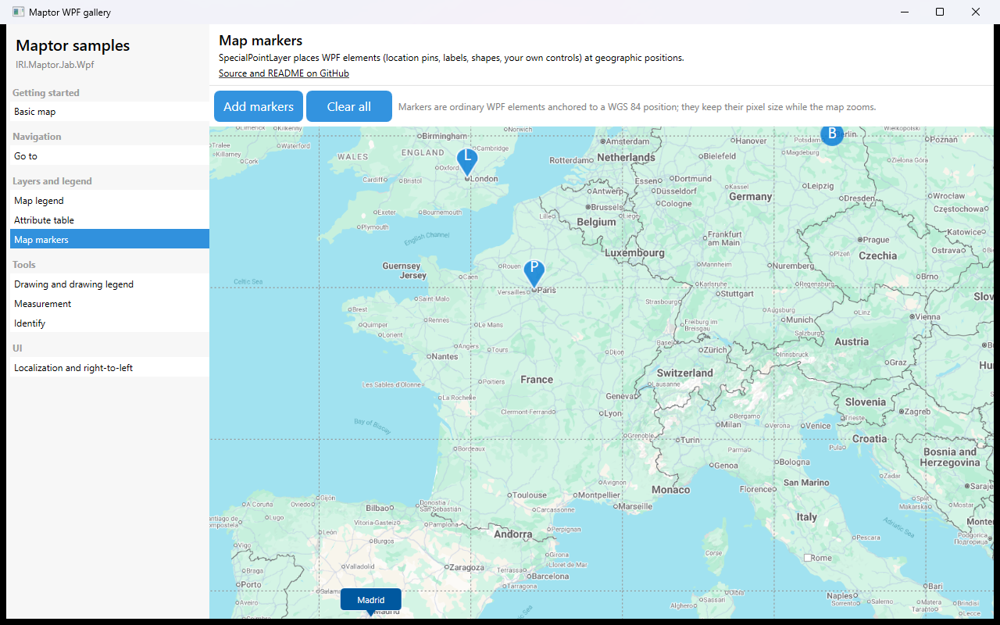

# Map markers

`SpecialPointLayer` places ordinary WPF elements at geographic positions. A `Locateable` is a WGS 84 point, an anchor rule (which point of the element sits on the position) and any `FrameworkElement`; the built-in markers in `IRI.Maptor.Presentation.Wpf.Controls.MapMarkers` cover pins, labels and shapes, and your own controls work the same way. The sample also shows the usual way to extend `MapViewModelBase` with a command of your own (`MapMarkersViewModel`).



## What it shows

- `Locateable(Point wgs84, AnchorFunctionHandler)` with `LocationMarker`, `PointMarker`, `RectangleMarker`, `LabelMarker`.
- `SpecialPointLayer(name, items, opacity, visibleRange, LayerType.Complex)` and `AddLayer`.
- A `RelayCommand` on a `MapViewModelBase` subclass, bound from XAML.

## The essential code

```csharp
var markers = new List<Locateable>
{
    new(new Point(-0.128, 51.507), AnchorFunctionHandlers.BottomCenter) { Element = new LocationMarker("L") },
    new(new Point(13.405, 52.520), AnchorFunctionHandlers.CenterCenter) { Element = new PointMarker("B") },
    new(new Point(-3.704, 40.417), AnchorFunctionHandlers.BottomCenter) { Element = new LabelMarker("Madrid", true) },
};

var layer = new SpecialPointLayer("Cities", markers, opacity: 0.9, visibleRange: ScaleInterval.All, type: LayerType.Complex);

AddLayer(layer);
ZoomToExtent(layer.Extent, isExactExtent: false, isNewExtent: true);
```

## How to run

```bash
dotnet run --project samples/IRI.Maptor.Samples.Wpf.Gallery
```

then pick **Map markers** in the list. Source: [`MapMarkersSample.xaml`](MapMarkersSample.xaml),
[`MapMarkersSample.xaml.cs`](MapMarkersSample.xaml.cs).

---
[Back to the gallery](../../README.md) · [Samples index](../../../README.md)
