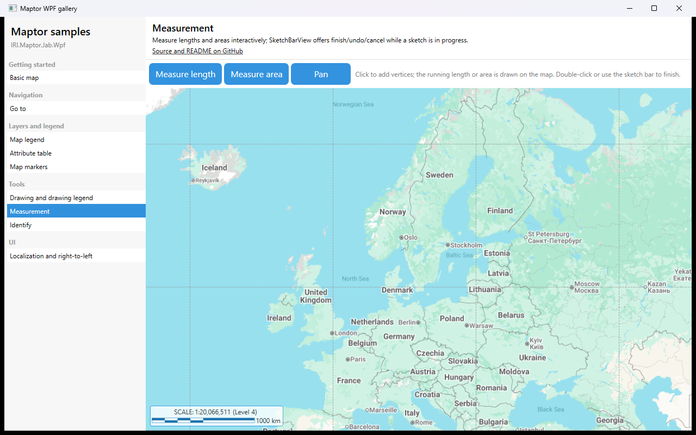

# Measurement

Measure lengths and areas interactively. Click to add vertices; the running value is drawn on the map; double-click or use the sketch bar to finish. **Pan** leaves the measuring mode.



## What it shows

- `MeasureLengthCommand`, `MeasureAreaCommand`, `PanCommand`.
- `SketchBarView` for finish / cancel while measuring.
- `Scalebar` alongside, so the measured value can be sanity-checked against the scale.

## The essential code

```xml
<Button Content="Measure length" Command="{Binding MeasureLengthCommand}" />
<Button Content="Measure area" Command="{Binding MeasureAreaCommand}" />

<Grid>
    <maptor:MapViewer x:Name="map" MapAction="{Binding MapAction, Mode=OneWay}" />
    <maptor:SketchBarView DataContext="{Binding}" />
</Grid>
```

## How to run

```bash
dotnet run --project samples/IRI.Maptor.Samples.Wpf.Gallery
```

then pick **Measurement** in the list. Source: [`MeasurementSample.xaml`](MeasurementSample.xaml),
[`MeasurementSample.xaml.cs`](MeasurementSample.xaml.cs).

---
[Back to the gallery](../../README.md) · [Samples index](../../../README.md)
