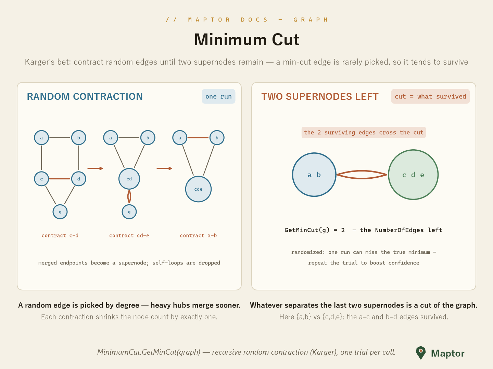

# Minimum cut

A **cut** splits a graph's nodes into two groups; its size is the number of edges crossing between them. The minimum cut is the cheapest way to disconnect the graph — how many roads must close before a region splits in two.

`MinimumCut` implements **Karger's randomized contraction**: repeatedly pick a random edge (weighted by degree), merge its endpoints into a supernode, drop the self-loops, and recurse until only two supernodes remain. The edges that survived between them are a cut — and because a min-cut edge is picked with low probability at every step, it *tends* to be the minimum one.

<p align="center">
  
</p>

```csharp
var g = new AdjacencyList<string, int>();
g.AddUndirectedEdge("a", "b", 1);
g.AddUndirectedEdge("a", "c", 1);
g.AddUndirectedEdge("b", "d", 1);
g.AddUndirectedEdge("c", "d", 1);
g.AddUndirectedEdge("c", "e", 1);
g.AddUndirectedEdge("d", "e", 1);

int cut = MinimumCut.GetMinCut(g);   // edge count of the final 2-node graph
```

> **Note** — the algorithm is randomized and `GetMinCut` runs a *single* contraction trial, so one call can return a larger-than-minimum cut. Run it several times and keep the smallest answer to boost confidence.

---
[Back to IRI.Maptor.Core.Graph](../README.md)
