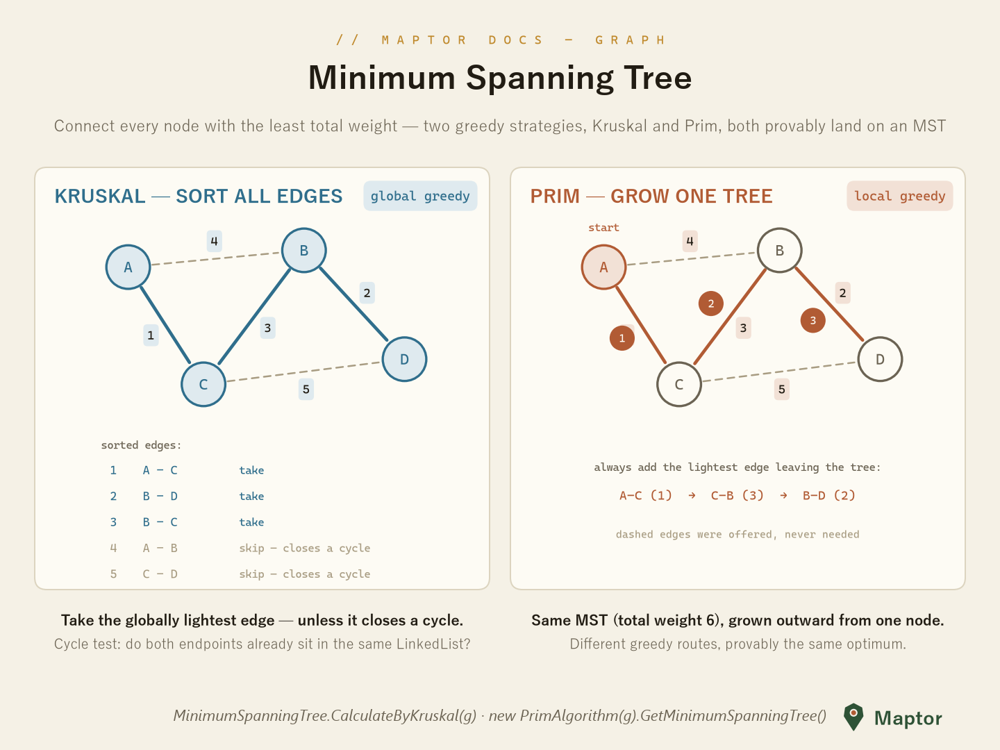

# Minimum spanning tree

Connect every node of an undirected weighted graph with the least total edge weight. Two greedy strategies get there — and provably reach the same optimum:

- **Kruskal** sorts *all* edges once, then takes each lightest edge unless it would close a cycle.
- **Prim** grows *one* tree from a start node, always adding the lightest edge that leaves it.

Both implementations share a LinkedList trick as their union-find: two endpoints are in the same component exactly when their `LinkedListNode.List` is the same list; merging clusters is splicing one list into the other.

<p align="center">
  
</p>

```csharp
var ug = new AdjacencyList<string, int>();
ug.AddUndirectedEdge("A", "B", 4);
ug.AddUndirectedEdge("A", "C", 1);
ug.AddUndirectedEdge("B", "C", 3);
ug.AddUndirectedEdge("B", "D", 2);
ug.AddUndirectedEdge("C", "D", 5);

// Kruskal — static, one call
var mstKruskal = MinimumSpanningTree.CalculateByKruskal<string, int>(ug);

// Prim — instance, grown from the first node
var prim    = new PrimAlgorithm<string, int>(ug);
var mstPrim = prim.GetMinimumSpanningTree();
```

Both return the MST as an undirected `AdjacencyList` (each tree edge stored in both directions). For the sample graph above the MST is `{A–C, B–D, B–C}` with total weight 6.

---
[Back to IRI.Maptor.Core.Graph](../README.md)
