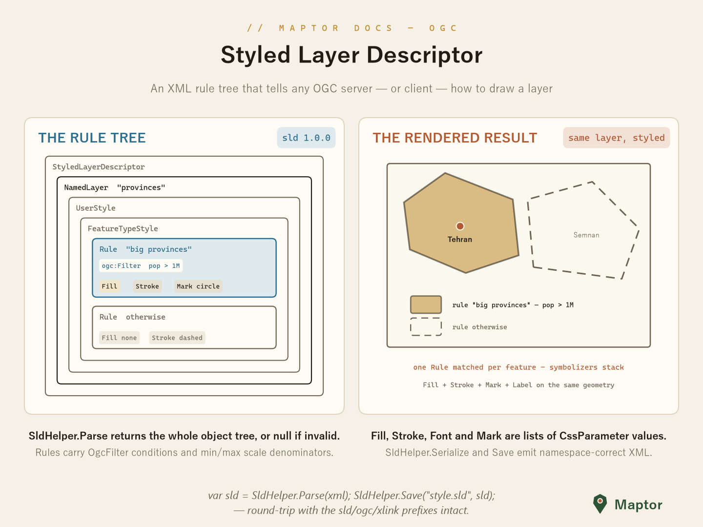

# SLD — Styled Layer Descriptor

An SLD 1.0.0 document is an XML rule tree that tells any OGC server — or client — how to draw a layer: `StyledLayerDescriptor` → `NamedLayer` → `UserStyle` → `FeatureTypeStyle` → `Rule` → symbolizers. Rule conditions reuse the project's Filter Encoding model (`OgcFilter`, from [../FilterEncoding](../FilterEncoding)).

<p align="center">
  
</p>

## The object model

The classes (namespace `IRI.Maptor.Core.Ogc.SLD`) mirror the spec: `PointSymbolizer`, `LineSymbolizer`, `PolygonSymbolizer`, `TextSymbolizer` and `RasterSymbolizer` are built from `Fill`, `Stroke`, `Font` and `Mark`, each carrying its settings as a list of `CssParameter` values (with enums `SldFontStyle`, `SldFontWeight`, `SldStrokeLineCap`, `SldStrokeLineJoin` for the fixed vocabularies). A `Rule` adds the `ogc:Filter` condition and min/max scale denominators.

```csharp
using IRI.Maptor.Core.Ogc.SLD;

var rule = sld.NamedLayers[0].UserStyles[0].FeatureTypeStyles[0].Rules[0];
// rule.Filter                 — the OgcFilter condition, e.g. pop > 1M
// rule.ElseFilter             — marks the fallback ("otherwise") rule
// rule.MinScaleDenominator    — visibility scale range (with Max…)
// rule.Symbolizers            — polymorphic list: Point/Line/Polygon/Text/RasterSymbolizer
```

## Reading and writing

`SldHelper` provides the entry points; parsing returns `null` when the XML isn't a valid SLD.

```csharp
StyledLayerDescriptor? sld = SldHelper.Parse(File.ReadAllText("example.sld"));

string? xml = SldHelper.Serialize(sld, indented: true);   // to a string
SldHelper.Save("example.sld", sld);                       // straight to a file
```

The namespace prefixes (`sld`, `ogc`, `xlink`, `xsi`) are emitted automatically from the declarations `StyledLayerDescriptor` carries, so no `XmlSerializerNamespaces` setup is required.

## References

- [OGC Styled Layer Descriptor Specification 1.0.0](https://portal.ogc.org/files/?artifact_id=1188)

---
[Back to IRI.Maptor.Core.Ogc](../README.md)
