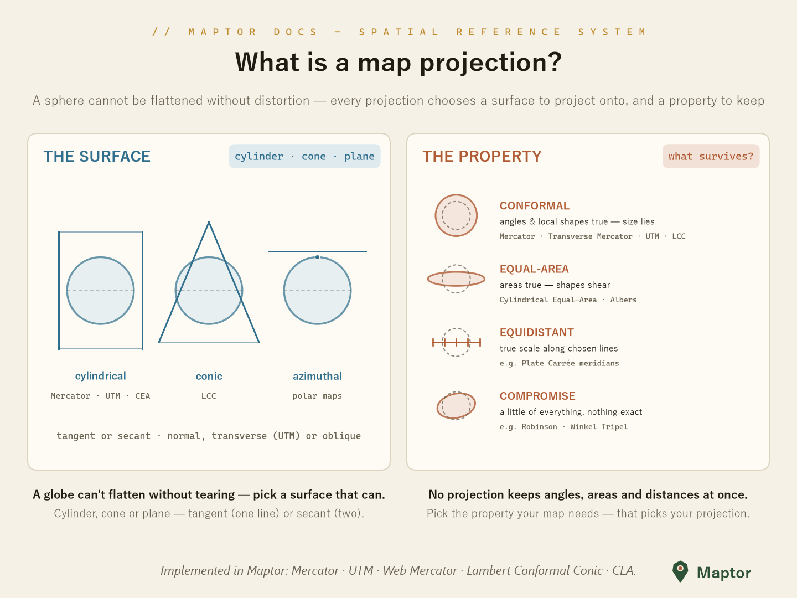
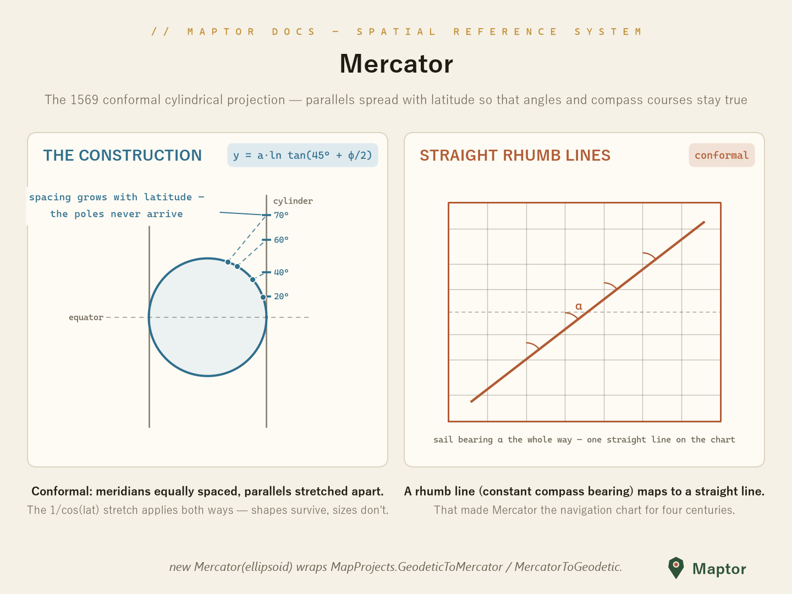
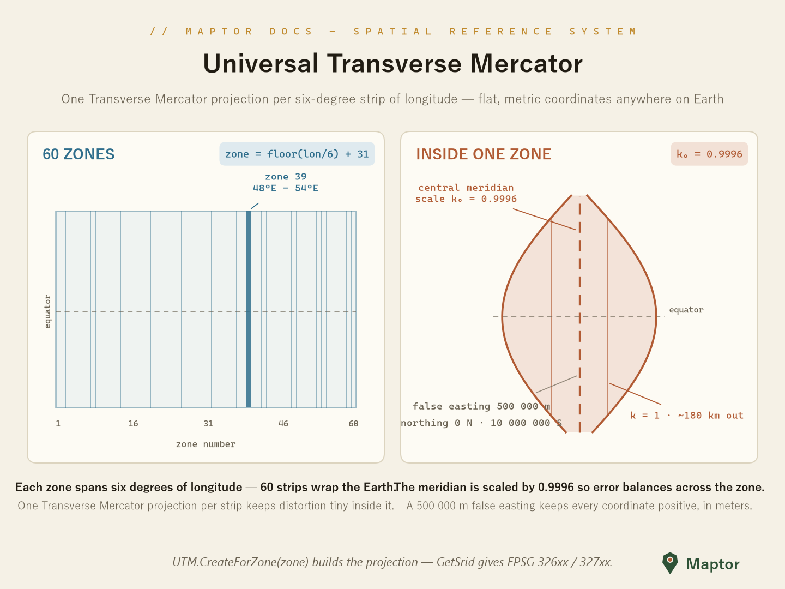
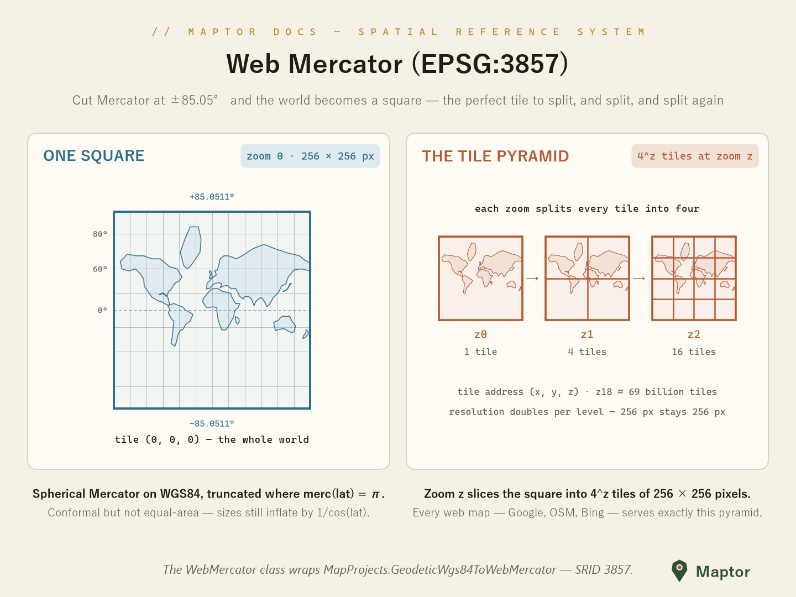
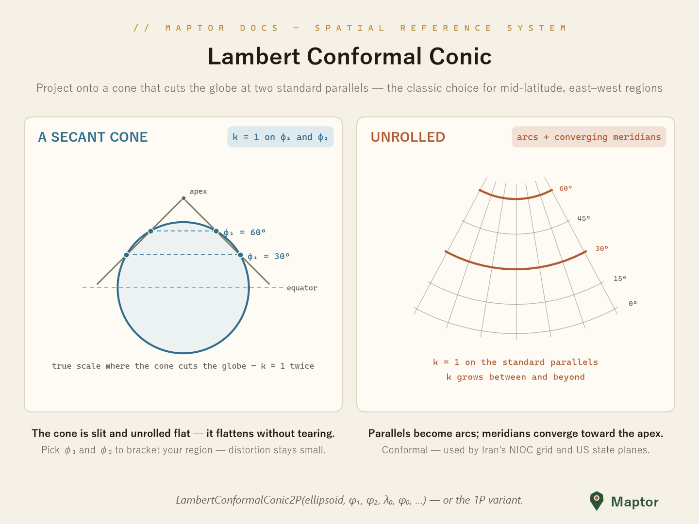
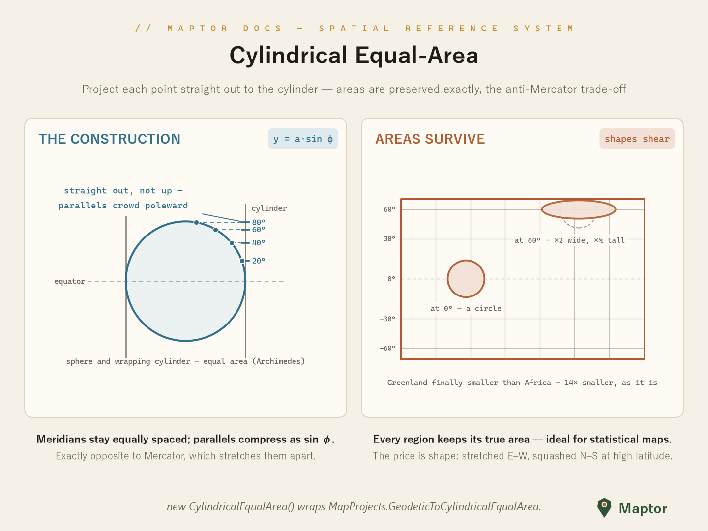

# Map projections

Map projections convert geodetic coordinates (latitude φ, longitude λ on a reference ellipsoid) into planar x/y coordinates and back. Every projection in this folder derives from [`MapProjectionBase`](MapProjectionBase.cs) (which extends [`SrsBase`](SrsBase.cs)) and shares the same API:

```csharp
TPoint FromGeodetic<TPoint>(TPoint point);   // (lon, lat) -> (x, y)
TPoint ToGeodetic<TPoint>(TPoint point);     // (x, y) -> (lon, lat)
int    Srid          // EPSG identifier
var    Ellipsoid     // the underlying horizontal datum
```

The heavy math lives in the static [`MapProjects`](../MapProjects.cs) class — the projection classes are thin, parameterized wrappers around it.

## What is a map projection?

<p align="center">
  
</p>

A sphere (or ellipsoid) cannot be flattened onto paper without distortion. Every projection therefore makes two choices:

1. **The surface** it projects onto — one that *can* be unrolled flat:
   - **Cylindrical** — a cylinder wrapped around the globe (Mercator, Cylindrical Equal-Area; *transverse* aspect wraps it around a meridian instead: Transverse Mercator, UTM)
   - **Conic** — a cone set over the globe (Lambert Conformal Conic)
   - **Azimuthal / planar** — a plane touching the globe (polar and hemisphere maps)

   The surface can touch the globe on one line (**tangent**) or cut through it on two (**secant** — UTM and 2-parallel LCC are secant, which spreads the low-distortion band wider).

2. **The property** it preserves — because it can't preserve everything at once:

   | Class | What survives | What lies | In this library |
   |-------|---------------|-----------|-----------------|
   | **Conformal** | Angles, local shapes | Areas/sizes | `Mercator`, `TransverseMercator`, `UTM`, `WebMercator`, `LambertConformalConic1P/2P` |
   | **Equal-area** | Areas | Shapes (they shear) | `CylindricalEqualArea` (also Albers in `MapProjects`) |
   | **Equidistant** | Distances along chosen lines | The rest | — |
   | **Compromise** | Nothing exactly, everything approximately | A little of all | — (e.g. Robinson, Winkel Tripel) |

Pick the property your map needs — that picks your projection: navigation and local surveying want conformal; density and statistics maps want equal-area.

## Implemented projections

| Class | Kind | Notes |
|-------|------|-------|
| [`Mercator`](Mercator.cs) | Conformal, cylindrical | The classic 1569 navigation projection |
| [`TransverseMercator`](TransverseMercator.cs) | Conformal, cylindrical (transverse) | The general form UTM is built on |
| [`UTM`](UTM.cs) | Conformal, cylindrical (transverse, secant) | 60 six-degree zones, k₀ = 0.9996, EPSG 326xx/327xx |
| [`WebMercator`](WebMercator.cs) | Conformal, cylindrical (auxiliary sphere) | The web-tile-map projection, EPSG 3857 |
| [`LambertConformalConic1P`](LambertConformalConic1P.cs) / [`LambertConformalConic2P`](LambertConformalConic2P.cs) | Conformal, conic (1 or 2 standard parallels) | Mid-latitude, east–west regions |
| [`CylindricalEqualArea`](CylindricalEqualArea.cs) | Equal-area, cylindrical | Preserves areas instead of angles |
| [`NoProjection`](NoProjection.cs) | — | Identity pass-through for unprojected geodetic data |

---

## Mercator

<p align="center">
  
</p>

The conformal cylindrical projection (Gerardus Mercator, 1569). Meridians stay equally spaced while parallels spread apart as `y = a·ln tan(45° + φ/2)`, exactly matching the E–W stretch — so angles survive everywhere. Its killer feature: a **rhumb line** (a course of constant compass bearing) maps to a straight line, which made it *the* navigation chart for four centuries. The price: scale inflates by 1/cos(φ) and the poles sit at infinity.

```csharp
var mercator = new Mercator(Ellipsoids.WGS84);

var xy  = mercator.FromGeodetic(new Point(51.389, 35.689));
var geo = mercator.ToGeodetic(xy);
```

---

## UTM — Universal Transverse Mercator

<p align="center">
  
</p>

UTM slices the world into **60 zones of longitude, six degrees each** (`zone = floor(lon / 6) + 31`). Each zone gets its own Transverse Mercator projection centered on the zone's **central meridian**, scaled by **k₀ = 0.9996** so scale error balances across the zone, with a **false easting of 500 000 m** so every easting stays positive. The result: flat, metric coordinates with tiny distortion anywhere inside the zone.

```csharp
using IRI.Maptor.Core.Common.Primitives;
using IRI.Maptor.Core.SpatialReferenceSystem;
using IRI.Maptor.Core.SpatialReferenceSystem.MapProjections;

// Zone 39 covers 48°E–54°E (e.g. Tehran); WGS84 by default
var utm = UTM.CreateForZone(39);

var projected = utm.FromGeodetic(new Point(51.389, 35.689));   // lon, lat -> easting, northing
var geodetic  = utm.ToGeodetic(projected);                     // and back

int srid = UTM.GetSrid(39, isNorthHemisphere: true);           // 32639 (EPSG)
```

Related helpers in `MapProjects`: `FindUtmZone(longitude)`, `CalculateCentralMeridian(zone)`, `GeodeticToUTM(...)` / `UTMToGeodetic(...)`, and `CalculateUTMScaleFactor(...)` for the point scale factor away from the central meridian.

---

## Web Mercator (EPSG:3857)

<p align="center">
  
</p>

Web Mercator is the projection behind virtually all web tile maps (Google, OSM, Bing, …). It applies the **spherical** Mercator formulas to WGS84 geodetic coordinates ("auxiliary sphere") and **truncates the map at ±85.0511°** — precisely the latitude where the Mercator y equals π·a — so the whole world becomes a **square**.

That square is the point: at zoom 0 the world is **one 256 × 256 px tile**; every zoom level splits each tile into four, giving **4ᶻ tiles at zoom z** (1 → 4 → 16 → …, about 69 billion at z18) addressed by `(x, y, z)`. Resolution doubles per level while each tile stays 256 px — the pyramid every slippy map serves.

It is conformal but **not equal-area**: scale still grows by 1/cos(latitude), so never measure areas or distances directly in Web Mercator coordinates.

```csharp
var webMercator = new WebMercator();

var xy  = webMercator.FromGeodetic(new Point(51.389, 35.689)); // lon, lat -> meters (EPSG:3857)
var geo = webMercator.ToGeodetic(xy);

// or call the math directly:
var xy2 = MapProjects.GeodeticWgs84ToWebMercator(new Point(51.389, 35.689));
```

---

## Lambert Conformal Conic

<p align="center">
  
</p>

Project onto a **cone** that cuts the globe at one or two **standard parallels**, then slit the cone and unroll it: parallels become concentric arcs, meridians straight lines converging on the apex. Scale is true (k = 1) on the standard parallels and grows away from them, so choosing φ₁ and φ₂ to bracket your region keeps distortion small — the classic conformal choice for **mid-latitude, east–west extents** (US state plane zones, and Iran's NIOC grid on the Clarke 1880 RGS datum).

```csharp
// two standard parallels bracketing the region of interest
var lcc = new LambertConformalConic2P(
    Ellipsoids.WGS84,
    standardParallel1: 30,
    standardParallel2: 36,
    centralMeridian: 53,
    latitudeOfOrigin: 33);

var xy  = lcc.FromGeodetic(new Point(51.389, 35.689));
var geo = lcc.ToGeodetic(xy);
```

`LambertConformalConic1P` is the single-parallel variant: the cone is tangent at `latitudeOfOrigin` (its cone constant is `n = sin(latitudeOfOrigin)`).

---

## Cylindrical Equal-Area

<p align="center">
  
</p>

Project each point **horizontally** out to the wrapping cylinder: `y = a·sin φ`. By Archimedes' hat-box theorem a sphere and its wrapping cylinder have equal area, so this preserves **areas exactly** — the anti-Mercator. Parallels compress toward the poles instead of spreading; shapes pay the price, stretching E–W and squashing N–S at high latitudes (a Tissot circle at 60° becomes twice as wide and half as tall — same area). Use it when areas must be honest: density, land-cover, and statistical maps.

```csharp
var cea = new CylindricalEqualArea();               // WGS84 by default

var xy  = cea.FromGeodetic(new Point(51.389, 35.689));
var geo = cea.ToGeodetic(xy);
```

---

[Back to IRI.Maptor.Core.SpatialReferenceSystem](../README.md) · datums and ellipsoids are documented in [Models](../Models/README.md).
