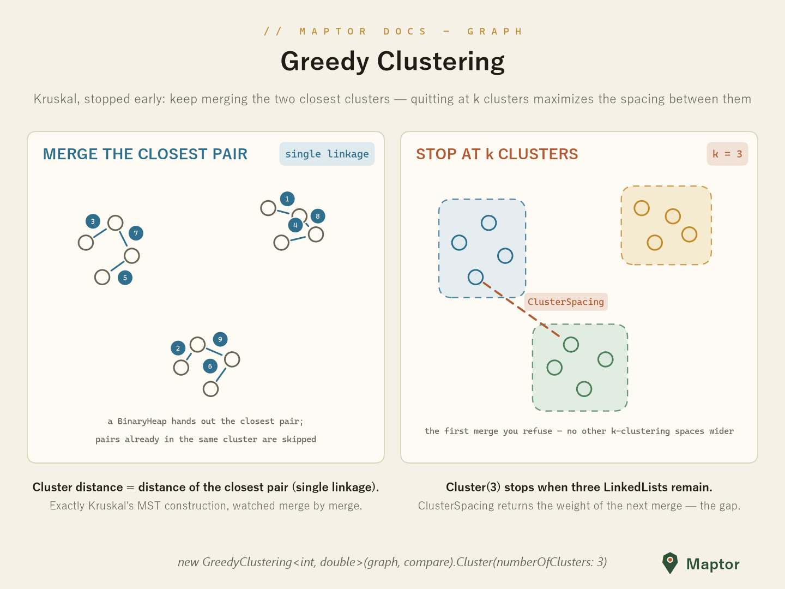

# Greedy Clustering

**Max-spacing k-clustering** — Kruskal's MST construction, stopped early. Every node starts as its own cluster; a `BinaryHeap` keeps handing over the closest pair of nodes, and if they sit in different clusters, the clusters merge (single linkage: the distance between two clusters is the distance of their closest pair). Stop when `k` clusters remain — greedy provably maximizes the spacing between them.

The weight of the first merge you *refuse* is exactly that spacing, exposed as `ClusterSpacing`. A natural fit for spatial grouping: nodes are points, edge weights are distances.



```csharp
// undirected graph whose edge weights are point-to-point distances
var g = new AdjacencyList<int, double>();
g.AddUndirectedEdge(0, 1, 12.5);
g.AddUndirectedEdge(0, 2, 40.1);
g.AddUndirectedEdge(1, 2, 35.8);
// ... one edge per candidate pair

var clustering = new GreedyClustering<int, double>(
    g, (e1, e2) => e1.Connection.Weight.CompareTo(e2.Connection.Weight));

// stop when exactly 3 clusters remain
List<LinkedList<int>> clusters = clustering.Cluster(numberOfClusters: 3);

// the gap the stop preserved — weight of the first refused merge
double spacing = clustering.ClusterSpacing;
```

A second overload, `Cluster(threshold, criteriaFunc, weightFunc)`, merges while a weight-vs-threshold predicate holds instead of counting clusters — useful when you know "merge anything closer than X meters" rather than the number of groups.
