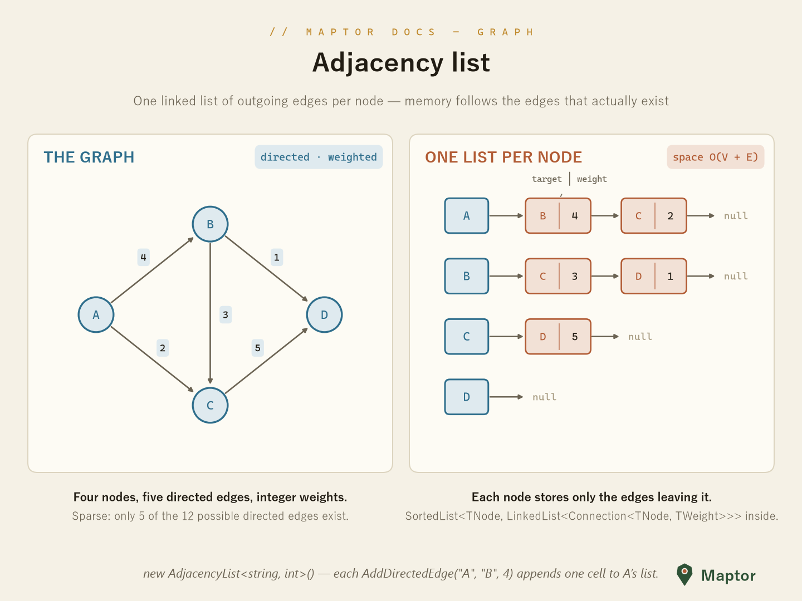
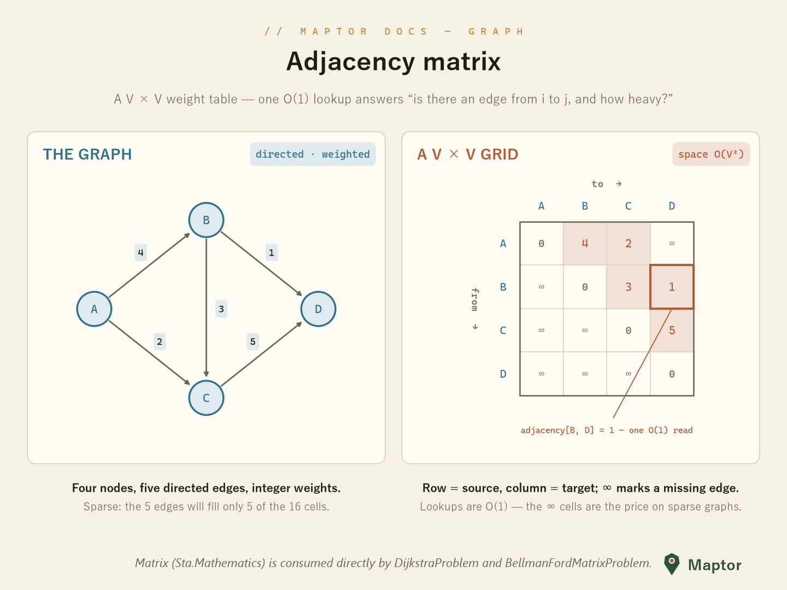

# Graph representation

How a graph is stored decides what is cheap and what is expensive. This library offers both classic representations.

## Adjacency list

`AdjacencyList<TNode, TWeight>` keeps **one linked list of outgoing edges per node** — internally a `SortedList<TNode, LinkedList<Connection<TNode, TWeight>>>`. Memory follows the edges that actually exist (`O(V + E)`), which makes it the right default for sparse graphs like road networks.

<p align="center">
  
</p>

```csharp
using IRI.Maptor.Sta.Graph;

var g = new AdjacencyList<string, int>();
g.AddDirectedEdge("A", "B", 4);
g.AddDirectedEdge("A", "C", 2);
g.AddUndirectedEdge("B", "D", 1);      // adds both directions

var neighbors = g.GetConnections("A"); // A's outgoing (target | weight) cells
var reversed  = g.Transpose();         // every edge flipped — used by SCC
```

## Adjacency matrix

The matrix form is a `V × V` weight table: row = source, column = target, `∞` for a missing edge. Any edge lookup is `O(1)`, at the price of `O(V²)` space — best for small or dense graphs.

<p align="center">
  
</p>

The matrix-based solvers (`DijkstraProblem`, `BellmanFordMatrixProblem`, `FloydWarshallProblem`) consume this form directly, and `AdjacencyList` has a constructor that converts a matrix into a list:

```csharp
// nodes + TWeight[,] adjacencyMatrix → adjacency list
var fromMatrix = new AdjacencyList<string, double>(nodes, adjacencyMatrix);
```

## Building blocks

- `Connection<TNode, TWeight>` — a directed half-edge: target node + weight.
- `Edge<TNode, TWeight>` — a full edge: source node + its `Connection`.
- `DirectedAcyclicGraph<TNode, TWeight>` — an `AdjacencyList` subclass for DAGs.

---
[Back to IRI.Maptor.Sta.Graph](../README.md)
