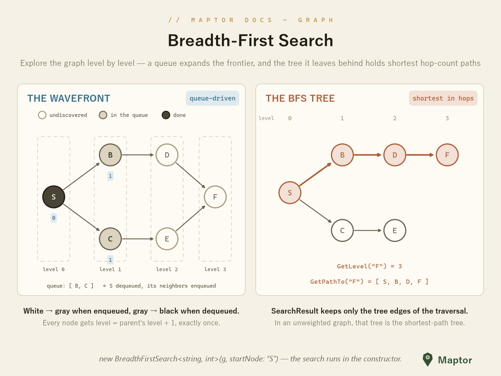
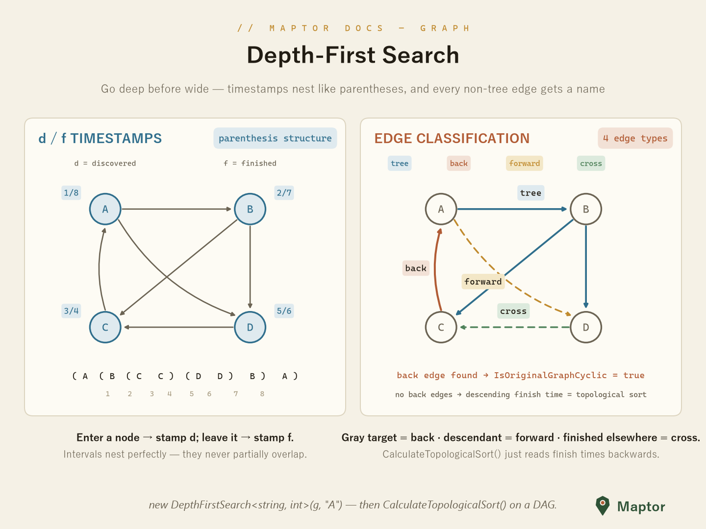
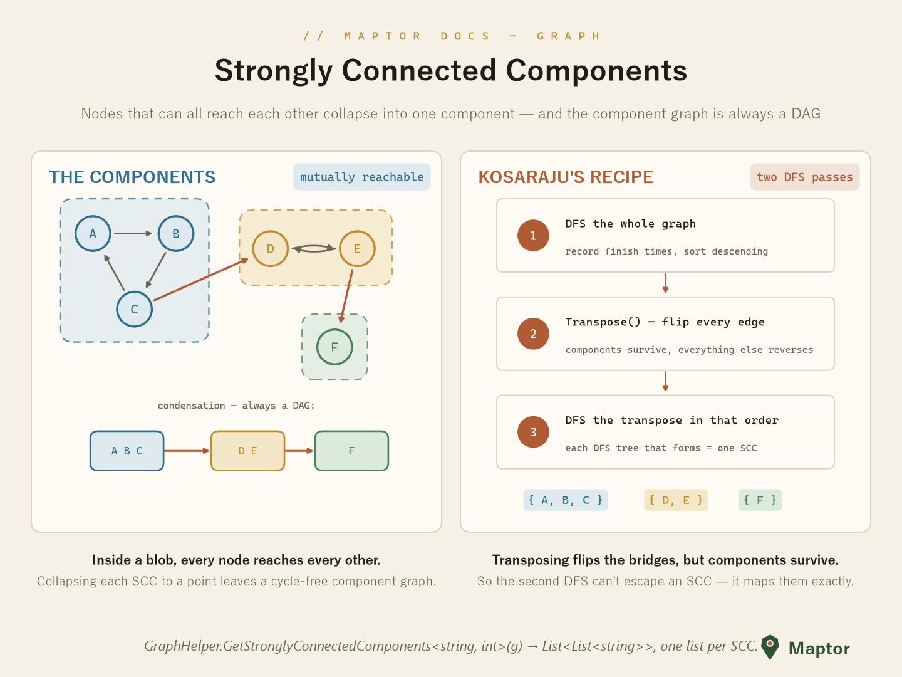

# Graph Search

Two traversal orders, two different superpowers: BFS finds shortest hop-count paths; DFS timestamps the graph and classifies every edge.

## Breadth-First Search (BFS)

`BreadthFirstSearch<TNode, TWeight>` explores the graph **level by level** from a start node. A queue drives the frontier: nodes go white → gray when enqueued, gray → black when dequeued, and every node gets `level = parent's level + 1`. The tree the traversal leaves behind (`SearchResult`) is the shortest-path tree in edge count.



```csharp
var bfs = new BreadthFirstSearch<string, int>(g, startNode: "S");

double level = bfs.GetLevel("F");     // hop distance, +∞ if unreachable
var path     = bfs.GetPathTo("F");    // e.g. ["S", "B", "D", "F"], null if none
var tree     = bfs.SearchResult;      // the BFS tree as an AdjacencyList
```

## Depth-First Search (DFS)

`DepthFirstSearch<TNode, TWeight>` goes **deep before wide**, stamping each node with a discovery and a finish time. The stamps nest like parentheses, and each non-tree edge gets classified — `Tree`, `Back`, `Forward` or `Cross`. One back edge is enough to prove a cycle; on a DAG, reading finish times backwards yields a topological sort.



```csharp
var dfs = new DepthFirstSearch<string, int>(dag, startNode: "A");

bool cyclic = dfs.IsOriginalGraphCyclic;            // any back edge?
var topo    = dfs.CalculateTopologicalSort();       // DAG only
var byTime  = dfs.GetSortedNodes(SortType.BasedOnFinishTime);
```

`FastDepthFirstSearch<TNode, TWeight>` is the iterative (stack-based) twin for large graphs where recursion depth matters.

## Strongly Connected Components (SCC)

A strongly connected component is a set of nodes that can **all reach each other**. Collapsing each SCC to a single point always leaves a cycle-free component graph (a DAG). The implementation is Kosaraju's algorithm — two DFS passes around a `Transpose()`:



```csharp
var components = GraphHelper.GetStronglyConnectedComponents<string, int>(g);
// List<List<string>> — one inner list per component
```
