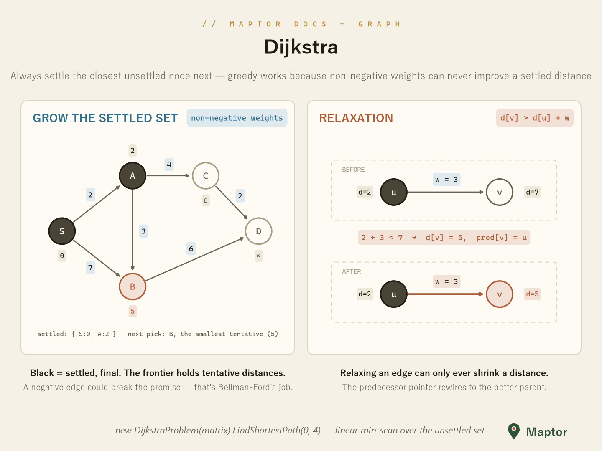
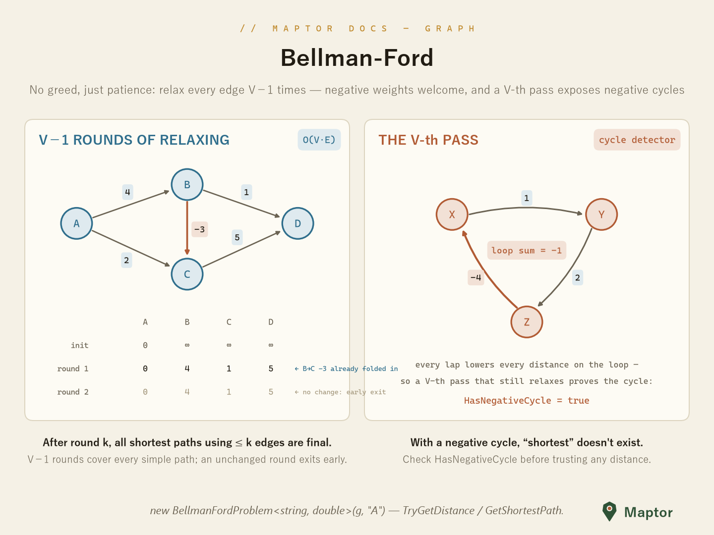
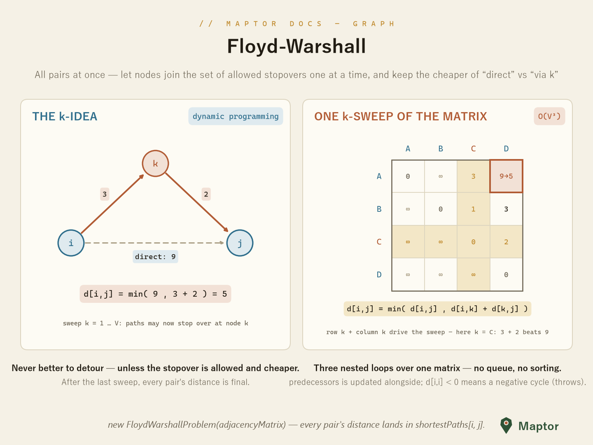

# Shortest paths

All three algorithms here share one primitive — **relaxation**: if going through `u` is cheaper (`d[u] + w < d[v]`), lower `d[v]` and repoint its predecessor. They differ only in *when* they relax, which decides what weights they tolerate and what they cost.

| Algorithm | Answers | Weights | Cost |
|---|---|---|---|
| Dijkstra | one source → all | non-negative only | greedy, settle-by-minimum |
| Bellman-Ford | one source → all | negatives OK, detects negative cycles | `O(V·E)` |
| Floyd-Warshall | **all pairs** | negatives OK, throws on negative cycle | `O(V³)` |

## Dijkstra

Greedy: always settle the unsettled node with the smallest tentative distance. That promise only holds when no edge can be negative. This implementation works on a `Matrix` adjacency and uses a linear min-scan over the unsettled set.

<p align="center">
  
</p>

```csharp
var dijkstra = new DijkstraProblem(adjacencyMatrix);   // Matrix (Sta.Mathematics)
List<int> path = dijkstra.FindShortestPath(0, 4);      // node indexes
```

## Bellman-Ford

No greed, just patience: relax **every** edge, `V−1` rounds (with an early exit when a round changes nothing). Negative weights are fine — and a V-th pass that still relaxes something proves a negative cycle.

<p align="center">
  
</p>

```csharp
var graph = new AdjacencyList<string, double>();
graph.AddDirectedEdge("A", "B", 4.0);
graph.AddDirectedEdge("B", "C", -3.0);      // negative weight allowed
graph.AddDirectedEdge("A", "C", 2.0);

var bf = new BellmanFordProblem<string, double>(graph, "A");
if (!bf.HasNegativeCycle && bf.TryGetDistance("C", out double d))
{
    List<string>? path = bf.GetShortestPath("C");
}
```

A `Matrix`-based twin, `BellmanFordMatrixProblem(matrix, sourceNodeIndex)`, mirrors the Dijkstra input style.

## Floyd-Warshall

All pairs at once, by dynamic programming: let nodes join the set of allowed stopovers one at a time and keep the cheaper of "direct" vs "via k" — `d[i,j] = min(d[i,j], d[i,k] + d[k,j])`. A negative value on the diagonal means a negative cycle (the constructor throws).

<p align="center">
  
</p>

```csharp
var fw = new FloydWarshallProblem(adjacency);   // double[,]
double dist = fw.shortestPaths[i, j];           // any pair, O(1) read
```

---
[Back to IRI.Maptor.Sta.Graph](../README.md)
