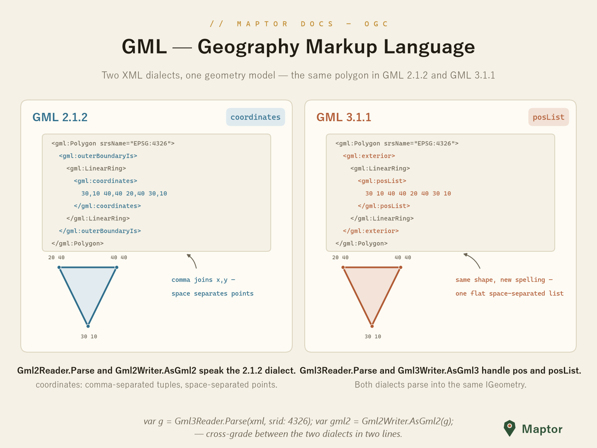

# GML — Geography Markup Language

OGC's XML encoding for geometry. This folder speaks both widely deployed dialects — same shapes, different spelling:

| Version | Ring element | Coordinate encoding |
|---|---|---|
| 2.1.2 | `<gml:outerBoundaryIs>` | `<gml:coordinates>` — comma joins x,y; space separates points |
| 3.1.1 | `<gml:exterior>` | `<gml:pos>` / `<gml:posList>` — one flat space-separated list |



## Reading GML

`Gml2Reader` and `Gml3Reader` (namespace `IRI.Maptor.Sta.Ogc.GML`) parse a GML fragment into the library's geometry model. Both dialects land in the same `IGeometry`, so downstream code never cares which version the server spoke.

```csharp
using IRI.Maptor.Sta.Ogc.GML;

var g2 = Gml2Reader.Parse(gml2Xml, srid: 4326);   // IGeometry — e.g. Type: Polygon
var g3 = Gml3Reader.Parse(gml3Xml, srid: 4326);   // same model, 3.1.1 dialect
```

## Writing GML

`Gml2Writer.AsGml2` and `Gml3Writer.AsGml3` serialize a geometry back out; `includeSrid` adds the `srsName` attribute.

```csharp
string gml2 = Gml2Writer.AsGml2(geometry);                      // <gml:Polygon><gml:outerBoundaryIs>…
string gml3 = Gml3Writer.AsGml3(geometry, includeSrid: true);   // <gml:Polygon srsName="EPSG:4326"><gml:exterior>…
```

Because both readers produce the same `IGeometry`, cross-grading between dialects is a read in one and a write in the other:

```csharp
string downgraded = Gml2Writer.AsGml2(Gml3Reader.Parse(gml3Xml, srid: 4326));
```

## Generated schema models

For schema-level XML work (building documents element by element rather than from geometries), the folders `v2.1.2/` and `v3.1.1/` carry the generated object models — `PointType`, `LineStringType`, `PolygonType`, `MultiPolygonType`, `CoordinatesType` and friends — under the `IRI.Maptor.Sta.Ogc.GML.v212` and `.v313` namespaces.
