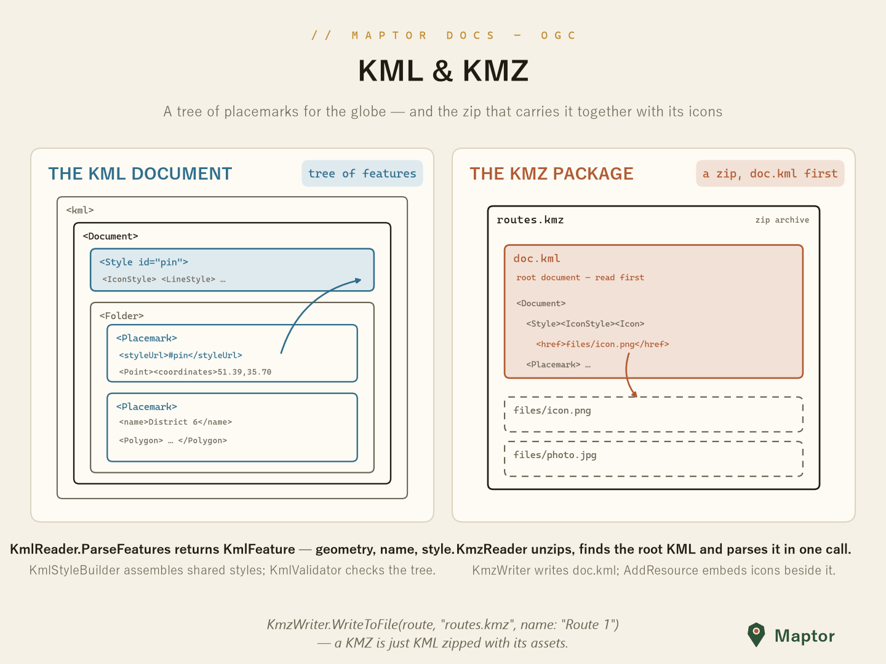

# KMZ — Zipped KML

A KMZ is a ZIP archive whose root document (`doc.kml`) travels together with the icons and images it references. The readers and writers here (namespace `IRI.Maptor.Sta.KmlFormat`) build on `KmlReader` / `KmlWriter`, so everything KML supports — features, styles, folders — works inside a KMZ too.



## Reading

`KmzReader` unzips, finds the root KML (preferring `doc.kml`) and parses it in one call. Embedded assets are listed and extracted separately.

```csharp
using IRI.Maptor.Sta.KmlFormat;

var geometries = KmzReader.ReadFromFile("map.kmz", targetSrid: 4326);   // List<IGeometry>
var features   = KmzReader.ReadFeaturesFromFile("map.kmz");             // List<KmlFeature>

var resources = KmzReader.GetResourceFiles("map.kmz");                  // ["images/icon.png", …]
byte[]? icon  = KmzReader.ExtractResource("map.kmz", "images/icon.png");
```

`KmzReader.Parse(stream)` reads from any stream, and every file method has an `Async` twin.

## Writing

`KmzWriter` writes the geometry (or features) as `doc.kml` inside the archive; `AddResource` embeds assets afterwards, under the relative path the KML's `<href>` elements use.

```csharp
KmzWriter.WriteToFile(geometry, "london.kmz", name: "London", description: "Capital of England");

KmzWriter.AddResourceFromFile("london.kmz", "images/icon.png", @"C:\assets\icon.png");
// in the KML: <href>images/icon.png</href> — always forward slashes, always relative
```

Extension methods in `IRI.Maptor.Extensions` shorten the common case: `geometry.SaveAsKmz("london.kmz", "London")` (plus `SaveAsKmzAsync`, and overloads for geometry lists and `KmlFeature` lists).

For document structure, styling and validation, see [../KML/README.md](../KML/README.md).
