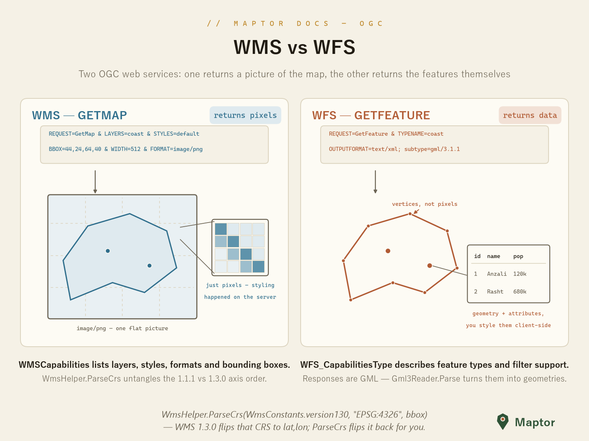

# WFS — Web Feature Service

Where WMS returns a picture of the map, WFS returns the features themselves — GML geometries with their attributes, styled by the client. This folder is the **generated object model** for WFS 1.1.0 capabilities and requests (namespace `IRI.Maptor.Sta.Ogc.WFS.v110`); there is no HTTP client here — bring your own transport and deserialize the responses.

<p align="center">
  
</p>

## The capabilities model

`WFS_CapabilitiesType` is the typed shape of a `GetCapabilities` response: `ServiceIdentification` and `ServiceProvider` describe the server, `FeatureTypeList` enumerates what you can query, and `Filter_Capabilities` says which spatial/scalar operators its filters support.

```csharp
using IRI.Maptor.Sta.Ogc.WFS.v110;
using System.Xml.Serialization;

var serializer = new XmlSerializer(typeof(WFS_CapabilitiesType));
using var reader = System.Xml.XmlReader.Create("capabilities.xml");
var caps = (WFS_CapabilitiesType)serializer.Deserialize(reader);

foreach (var ft in caps.FeatureTypeList.FeatureType)
    Console.WriteLine($"{ft.Name} — {ft.Title}");   // e.g. "topp:states — USA states"
```

Each `FeatureTypeType` also carries its `WGS84BoundingBox`, supported `OutputFormats` and allowed `Operations` (Query, Insert, Update, …).

## Requests and responses

`GetCapabilitiesType` (and the related request types) model the request side for building or binding request XML. The two companion pieces live next door:

- **Responses** — a `GetFeature` reply is GML: parse the member geometries with `Gml3Reader.Parse` from [../GML/README.md](../GML/README.md).
- **Filters** — the `<ogc:Filter>` expressions inside a query come from the shared Filter Encoding model (`OgcFilter`, `OgcBBOX`, `OgcPropertyIsEqualTo`, …) in [../FilterEncoding](../FilterEncoding).

---
[Back to IRI.Maptor.Sta.Ogc](../README.md)
