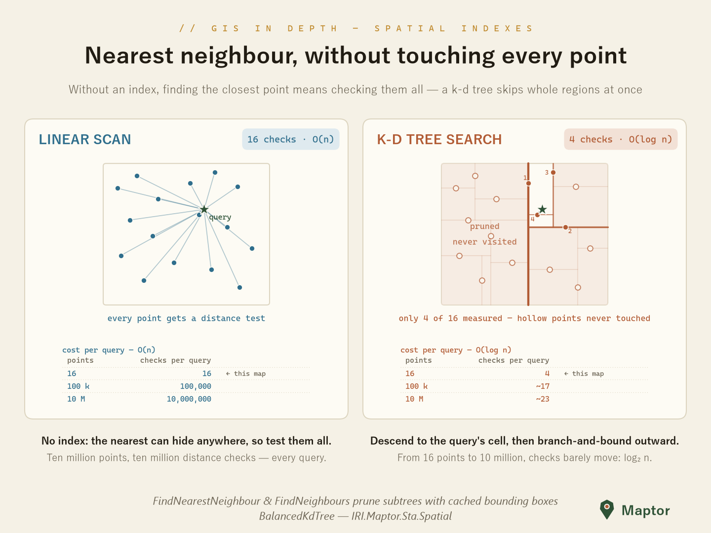
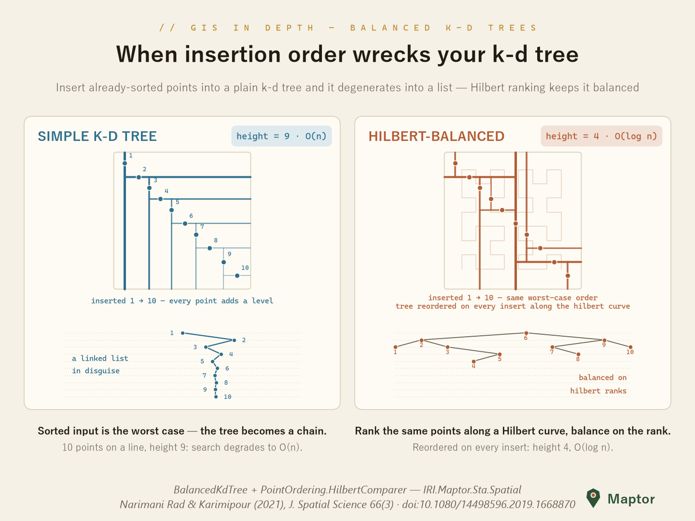

# K-d trees

A k-d tree slices space in half at every node — x at even levels, y at odd — so a query walks down to the region it cares about and never looks at the rest of the map.

<p align="center">
  
</p>

Finding the closest of 16 points costs 16 distance tests without an index and 4 with one. The gap widens with scale: 10 million points still cost ~23 checks, because each level halves what is left to search.

## The two classes

| | `KdTree<T>` | `BalancedKdTree<T>` |
|---|---|---|
| Balancing | none — shape follows insertion order | red-black rotations on every insert |
| Node boxes | no | every node caches its subtree's `MinimumBoundingBox` |
| Queries | none — structure only | `FindNearestNeighbour`, `FindNeighbours` |
| Use it for | teaching, tiny static sets | everything else |

Both queries are verified against a brute-force scan in the test suite.

## KdTree — the plain form

`KdTree<T>` cycles through the comparers you supply, one per level, and hangs each new point wherever it falls off the tree. Nothing rebalances.

```csharp
using IRI.Maptor.Sta.Common.Primitives;
using IRI.Maptor.Sta.Spatial.AdvancedStructures;

var points = new[]
{
    new Point(51.33, 35.70), new Point(51.42, 35.75),
    new Point(51.38, 35.68), new Point(51.45, 35.72),
};

var comparers = new List<Func<Point, Point, int>>
{
    (p1, p2) => p1.X.CompareTo(p2.X),   // even levels split on x
    (p1, p2) => p1.Y.CompareTo(p2.Y),   // odd levels split on y
};

var tree = new KdTree<Point>(points, comparers);

var root = tree.Root;                    // walk it yourself: Point, LeftChild, RightChild
```

The class exposes the structure and nothing else — no search methods. Reach for it when you want to inspect how splitting works; use `BalancedKdTree<T>` in production.

## BalancedKdTree — the production form

Same splitting idea, plus red-black balancing and cached bounding boxes. It answers the two classic spatial questions:

```csharp
using IRI.Maptor.Sta.Common.Primitives;
using IRI.Maptor.Sta.Spatial.AdvancedStructures;

var tree = new BalancedKdTree<Point>(points, comparers, Point.NaN, p => p);

// closest feature to a click
var nearest = tree.FindNearestNeighbour(new Point(51.40, 35.71));

// everything inside a tolerance radius
var withinRange = tree.FindNeighbours(new Point(51.40, 35.71), distance: 0.05);

// add more points later — the tree rebalances itself
tree.Insert(new Point(51.36, 35.69));

var all = tree.GetAllValues();
```

The last two constructor arguments are worth a word. `nilValue` is the sentinel the tree hands to its leaf terminator (`Point.NaN` for points), and `pointFunc` tells the tree how to read coordinates out of `T` — pass `p => p` when `T` is already an `IPoint`, or a selector when it is your own type:

```csharp
// index your own records, not bare points
var tree = new BalancedKdTree<Station>(stations, stationComparers,
                                       nilValue: Station.Empty,
                                       pointFunc: s => s.Location);
```

Both queries take an optional distance function. The default is Euclidean; swap in an ellipsoidal one when the coordinates are geographic:

```csharp
using IRI.Maptor.Sta.Spatial.Analysis;

var nearest = tree.FindNearestNeighbour(
    new Point(51.40, 35.71),
    (p1, p2) => SpatialUtility.GetEllipsoidalLength(p1, p2));
```

## Insertion order is the catch

A k-d tree is only fast while it stays shallow, and the plain insertion algorithm makes no such promise. Feed it points that are already sorted — a GPS track, road vertices, scanline output — and every comparison sends the new point the same way, so the tree degenerates into a linked list.

<p align="center">
  
</p>

Ten points on a line give a plain tree of height 9. Ranking the same points along a **Hilbert curve** and balancing on that rank gives height 4:

```csharp
using IRI.Maptor.Sta.Spatial.Analysis.SFC;

// one comparer: the point's position along a Hilbert curve over the data extent
var boundary = PointOrdering.GetBoundary(points, 0.5);

var hilbertComparer = new List<Func<Point, Point, int>>
{
    (p1, p2) => PointOrdering.HilbertComparer(p1, p2, boundary)
};

var balanced = new BalancedKdTree<Point>(points, hilbertComparer, Point.NaN, p => p);
```

> Full story, with the numbers and the theory: [Hilbert-balanced k-d tree — when insertion order matters](HilbertBalancedKdTree.md).

## One comparer or two

The two forms above are not interchangeable, and the difference is worth understanding before you pick one.

`BalancedKdTree<T>` chooses a node's comparer from that node's depth — `comparers[level % comparers.Count]` — but a red-black rotation moves nodes between depths. A node inserted at depth 1 under "compare on y", whose subtree was partitioned by y, can end up at depth 0 where the tree now says "compare on x". So **with more than one comparer the k-d ordering invariant does not survive balancing**:

- **Queries stay correct.** `FindNearestNeighbour` and `FindNeighbours` prune on each node's cached `MinimumBoundingBox` and never consult the comparers at all. Both are checked against a brute-force scan in the test suite, with x/y comparers.
- **Pruning gets weaker.** Points land in whichever subtree the mismatched comparison sends them, so the cached boxes overlap more than they need to and a query rules out fewer subtrees.

With a **single** total-order comparer — the Hilbert rank — `level % 1` is always `0`, every node uses the same key, and the structure is an ordinary 1-D search tree where rotations are exactly valid. That is the form to reach for when the index has to stay fast:

| | x/y comparers | single Hilbert comparer |
|---|---|---|
| Balance | kept — rotations are structural | kept |
| Ordering invariant | not maintained after rotations | exact |
| Query results | correct | correct |
| Box tightness | degrades as the tree is rotated | holds, and Hilbert locality keeps boxes small |

## Files

`KdTree.cs`, `KdTreeNode.cs` — the plain tree. `BalancedKdTree.cs`, `BalancedKdTreeNode.cs` — the balanced one. All four live in namespace `IRI.Maptor.Sta.Spatial.AdvancedStructures`.

## Reference

The Hilbert ordering used for balancing, and the higher-order construction of the curves behind it:

> Narimani Rad, H., & Karimipour, F. (2021). *Representation and generation of space-filling curves: a higher-order functional approach.* Journal of Spatial Science, 66(3), 459–479. [doi:10.1080/14498596.2019.1668870](https://doi.org/10.1080/14498596.2019.1668870)

---

**NuGet**: [IRI.Maptor.Sta.Spatial](https://www.nuget.org/packages/IRI.Maptor.Sta.Spatial)

**Issues**: [GitHub Issues](https://github.com/hosseinnarimanirad/Maptor/issues)

[Back to Advanced structures](../README.md)
