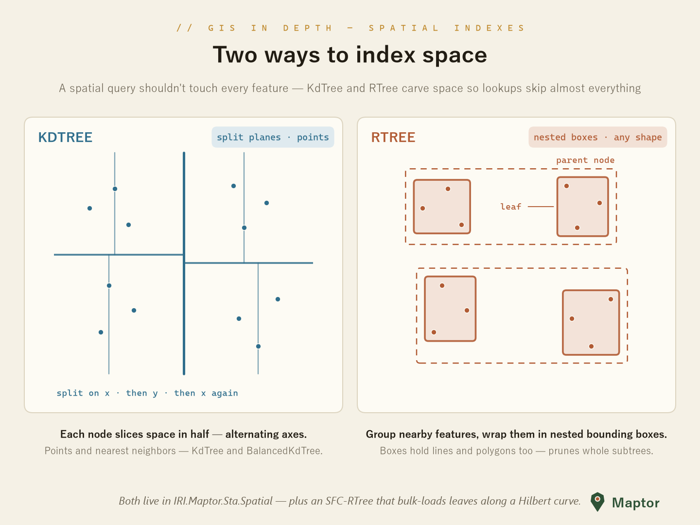

# Advanced Structures

Spatial indexes and point clustering: a spatial query shouldn't touch every feature — these structures carve space so lookups skip almost everything.

<p align="center">
  
</p>

## KdTree & BalancedKdTree

`KdTree<T>` slices space in half at every node, cycling through the supplied comparers by depth (x, then y, then x again…). `BalancedKdTree<T>` is the production variant — red-black balancing keeps the tree shallow under any insertion order, every node caches its subtree's bounding box, and it answers the two classic queries: **nearest neighbour** and **all neighbours within a radius**.

```csharp
using IRI.Maptor.Sta.Common.Primitives;
using IRI.Maptor.Sta.Spatial.AdvancedStructures;

var comparers = new List<Func<Point, Point, int>>
{
    (p1, p2) => p1.X.CompareTo(p2.X),   // even levels split on x
    (p1, p2) => p1.Y.CompareTo(p2.Y),   // odd levels split on y
};

var tree = new BalancedKdTree<Point>(points, comparers, Point.NaN, p => p);

var nearest    = tree.FindNearestNeighbour(new Point(51.4, 35.7));
var withinToleranceRange = tree.FindNeighbours(new Point(51.4, 35.7), distance: 0.05);
```

## RTree & SFCRTree

`RTree` groups nearby `Rectangle`s and wraps them in nested bounding boxes, B-tree style — a query prunes whole subtrees at once. New keys descend into the child whose box needs the **least area enlargement**.

`SFCRTree` bulk-loads the same structure along a **space-filling curve**: leaves are packed in curve order, so map-neighbours stay disk-neighbours. Pick the ordering with a comparer — `SFCRTree.HilbertComparer`, `ZOrderingComparer`, `GrayComparer`, `PeanoComparer` and friends.

<p align="center">
  
</p>

> Both R-tree flavours are early-stage implementations (marked untested in source) — the k-d trees are the battle-tested pair.

## GeoStatistics — point clustering

`PointClusters<T>` greedily groups points by any membership rule you supply; `KdTreePointClusters<T>` runs the same idea on top of a `BalancedKdTree` so each membership test only probes nearby candidates. The one-shot helper covers the common case — cluster by radius and keep one representative per group:

```csharp
using IRI.Maptor.Sta.Spatial.AdvancedStructures;

// thin out a dense point set: one center per 0.01°-radius cluster
var centers = KdTreePointClusters<Point>.GetClusterCenters(points, Point.NaN, radius: 0.01);
```

---

📦 **NuGet**: [IRI.Maptor.Sta.Spatial](https://www.nuget.org/packages/IRI.Maptor.Sta.Spatial)

🐞 **Issues**: [GitHub Issues](https://github.com/hosseinnarimanirad/Maptor/issues)
