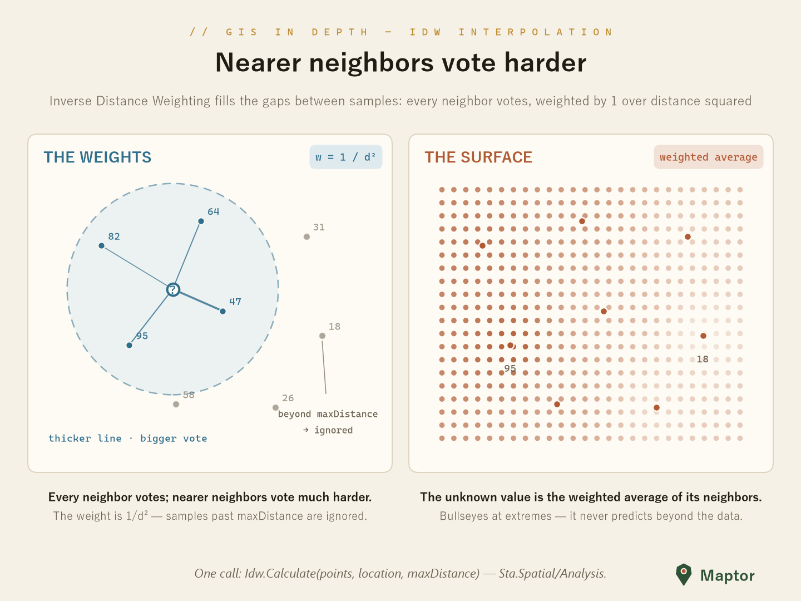

# Spatial interpolation

Rain gauges, elevation benchmarks, pollution sensors — measurements come as scattered points, but the question is usually about the gap between them. Interpolation estimates a value between samples: every neighbour votes, nearer neighbours vote harder.

## Inverse distance weighting (IDW)

IDW answers like an election. `Idw.Calculate` weighs each sample by **1 / distance²** and returns the weighted average of the `Z` values — the nearer a sample, the harder it votes. Two rules keep it honest:

- **`maxDistance` cutoff** — samples farther than `maxDistance` are ignored; if none qualify, the result is `null`. IDW never invents data beyond its neighbours.
- **It can't go beyond its inputs** — the estimate always stays between the smallest and largest `Z` in range, so it never predicts a peak above the highest sample. On the interpolated surface, extreme samples become bullseyes (right panel below).

<p align="center">
  
</p>

```csharp
using IRI.Maptor.Sta.Common.Primitives;
using IRI.Maptor.Sta.Spatial.Analysis;

var samples = new List<PointZM>
{
    // within maxDistance of the query point — these vote
    new PointZM(51.435, 35.701, 47),   // Z carries the measured value; nearest → biggest vote
    new PointZM(51.351, 35.670, 95),
    new PointZM(51.415, 35.782, 64),
    new PointZM(51.326, 35.760, 82),

    // beyond maxDistance → ignored
    new PointZM(51.393, 35.617, 58),
    new PointZM(51.511, 35.768, 31),
    new PointZM(51.525, 35.679, 18),
    new PointZM(51.482, 35.615, 26),
};

double? value = Idw.Calculate(samples, new Point(51.390, 35.720), maxDistance: 0.1);
// ≈ 67.5 — weighted average of 47, 95, 64 and 82; null if no sample is in range
```

Interpolating from a TIN instead (planar, per-triangle) lives in [DigitalTerrainModeling](../DigitalTerrainModeling/README.md) — `IrregularDtm.Interpolate`.

---

**NuGet**: [IRI.Maptor.Sta.Spatial](https://www.nuget.org/packages/IRI.Maptor.Sta.Spatial)

**Issues**: [GitHub Issues](https://github.com/hosseinnarimanirad/Maptor/issues)

[Back to Spatial analysis](../README.md)
