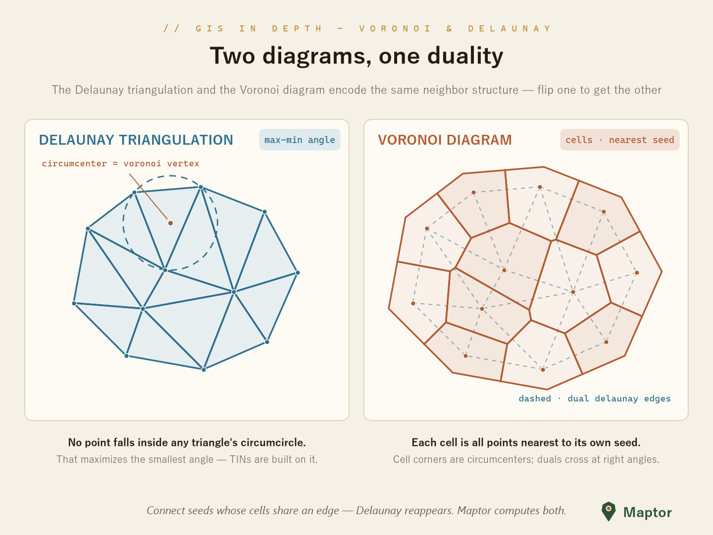
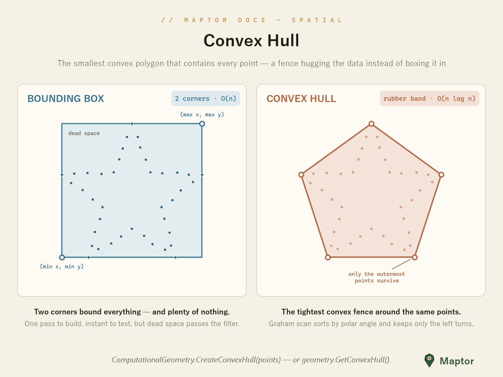
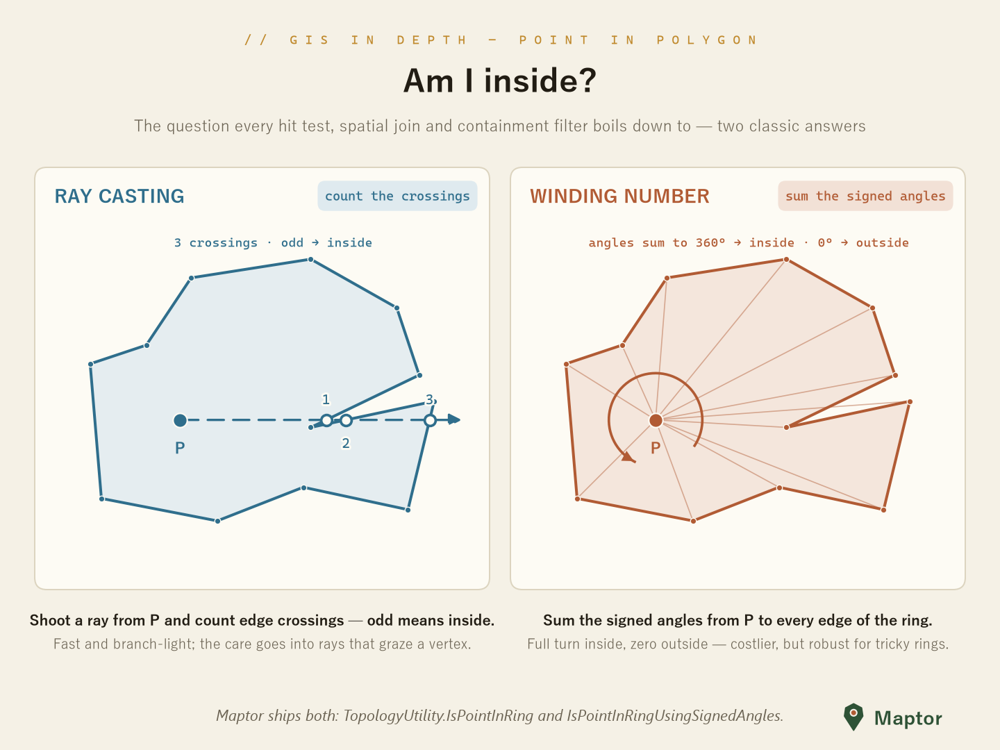
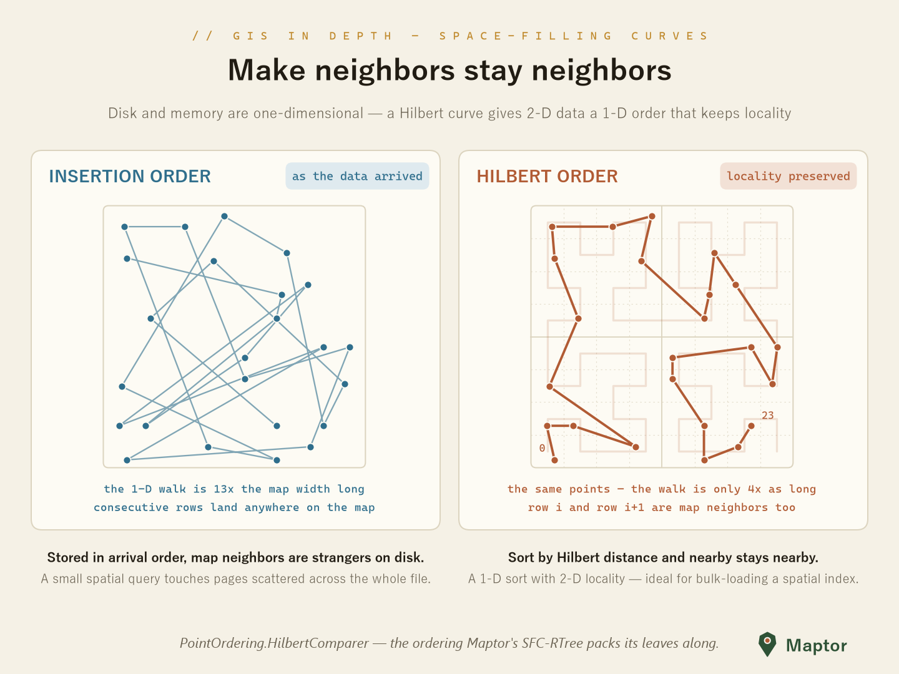

# Spatial Analysis

The algorithm toolbox of `IRI.Maptor.Sta.Spatial`: triangulation and Voronoi diagrams, convex hulls, line simplification, topology predicates, space-filling curves, and network building — all on plain geometry types, no UI dependencies.

## Delaunay Triangulation & Voronoi Diagrams

`DelaunayTriangulation` is a Bowyer–Watson incremental insertion. Triangles come back as CCW vertex indices with per-edge neighbour links (`-1` on the convex hull), and the dual Voronoi diagram comes for free: every triangle's circumcenter is a Voronoi vertex, and hull cells stay open as infinite rays.



```csharp
using IRI.Maptor.Sta.Common.Primitives;
using IRI.Maptor.Sta.Spatial.Analysis;

var triangulation = DelaunayTriangulation.Create(points);      // IReadOnlyList<Point>, ≥ 3 points

var triangles = triangulation.Triangles;                       // CCW indices + neighbours
int hit       = triangulation.FindContainingTriangle(p);       // walk; -1 outside the hull

var voronoi = triangulation.GetVoronoiDiagram();               // or VoronoiDiagram.Create(points)
// voronoi.Cells (IsClosed = false on the hull), voronoi.Edges (rays have VertexB == -1)
```

## Convex Hull

`ComputationalGeometry.CreateConvexHull` is a Graham scan — sort by polar angle, keep only the left turns. It returns the hull vertices counter-clockwise; duplicates and collinear edge points are dropped.



```csharp
List<Point> hull = ComputationalGeometry.CreateConvexHull(points);

var hullPolygon = geometry.GetConvexHull();   // same thing on any Geometry<T>
```

## Simplification

`Simplifications` collects ~20 line-simplification algorithms behind one shape: `SimplifyByXxx<T>(List<T> points, SimplificationParameters parameters)` where `T : IPoint`. Thresholds ride in `SimplificationParameters` (`DistanceThreshold`, `AreaThreshold`, `AngleThreshold` — the *square cosine* of the angle — `N`, `LookAhead`, `Retain3Points`).

| Family | Methods |
|---|---|
| Global tolerance | `SimplifyByRamerDouglasPeucker` |
| Area-based | `SimplifyByVisvalingamWhyatt` (extra `bool isRing`), `SimplifyByAdditiveAreaPlus`, triangle-routine family |
| Corridor / sleeve | `SimplifyByReumannWitkam`, `SimplifyByPerpendicularDistance`, `SimplifyBySleeveFitting`, opening-window pair |
| Local geometry | `SimplifyByAngle`, `SimplifyByEuclideanDistance` and their cumulative variants, `SimplifyByLang` |
| Sampling | `SimplifyByNthPoint`, `SimplifyByRandomPointSelection` |
| Segment collapse | `SimplifyByAPSC` (Kronenfeld et al. 2020 — minimizes areal displacement) |

```csharp
var parameters = new SimplificationParameters { DistanceThreshold = 0.001 };

var simplified = Simplifications.SimplifyByRamerDouglasPeucker(line.Points, parameters);
```

`SimplificationMetrics` scores the result with McMaster's measures: `PercentageChangeInLineLength`, `PercentageChangeInCoordinates`, `PercentageChangeInPointDensity`.

## Topology

The `Topology/` enums (`PointPolygonRelation`, `LineLineRelation`, `PointCircleRelation`, …) name the answers; the predicates live in `TopologyUtility` (namespace `IRI.Maptor.Sta.Spatial.Helpers`). Point-in-polygon ships in both classic flavours:



```csharp
using IRI.Maptor.Sta.Spatial.Helpers;

bool inside  = TopologyUtility.IsPointInRing(ring, point);                  // even-odd ray casting
bool winding = TopologyUtility.IsPointInRingUsingSignedAngles(ring, point); // winding number
bool inPoly  = TopologyUtility.IsPointInPolygon(polygonOrMultiPolygon, point);
```

Also here: segment–segment intersection (`LineSegmentsIntersects`), point–segment distance, the point/circumcircle test (`GetPointCircleRelation`), and left/right-of-vector classification (`GetPointVectorRelation`, with an optional `tolerance`).

## Space-Filling Curves (SFC)

Hilbert, Z-order (Morton) and other curve orderings that linearize 2-D data while keeping neighbours close — the backbone of `SFCRTree` bulk-loading and locality-preserving sorts. See the dedicated [SFC README](SFC/README.md).



## Network

`LineNetworkBuilder<T>` turns a pile of line features into edge–node topology: coincident endpoints snap together within a tolerance, shared vertices become junctions, and the result bridges straight into the Sta.Graph algorithms.

```csharp
using IRI.Maptor.Sta.Spatial.Analysis.Network;

var network = new LineNetworkBuilder<Point>(LineNetworkBuilder<Point>.GetDefaultTolerance(srid))
                    .Build(lineFeatures);

var components = network.GetConnectedComponents();  // disconnected islands
var graph      = network.ToAdjacencyList();         // → Sta.Graph: Dijkstra, BFS, …
```

## Statistics & Shape Characteristics

`AreaStatistics` summarizes the area distribution of a set of `Geometry<Point>` polygons (mean, standard deviation, histogram, CSV export). The `CharacteristicsMeasure` enum names McMaster's displacement measures (PCC, PDD, PCLL, …) computed by the simplification metrics above.

## Going further

- **[Digital Terrain Modeling](DigitalTerrainModeling/README.md)** — grid DEMs, TINs, slope/aspect, volume
- **[Interpolation](Interpolation/README.md)** — inverse distance weighting (IDW)

---

📦 **NuGet**: [IRI.Maptor.Sta.Spatial](https://www.nuget.org/packages/IRI.Maptor.Sta.Spatial)

🐞 **Issues**: [GitHub Issues](https://github.com/hosseinnarimanirad/Maptor/issues)
