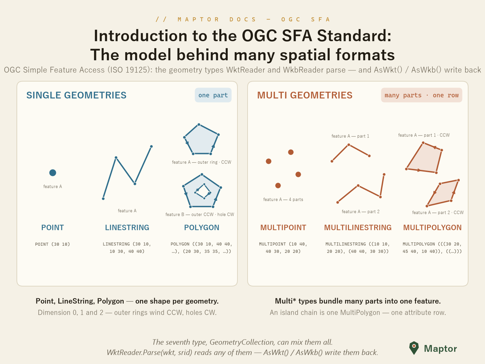
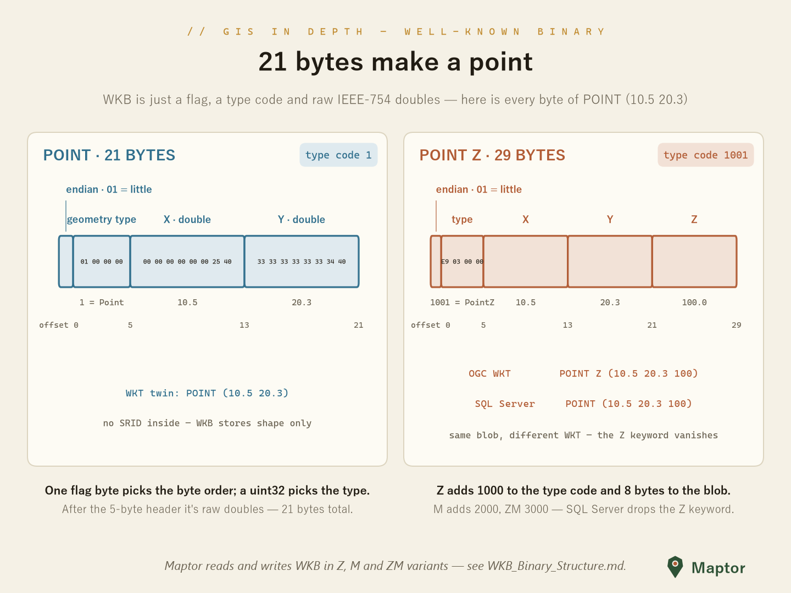

# Simple Features: WKT & WKB

OGC Simple Feature Access (ISO 19125) serialization for `Geometry<T>` — one geometry model, three encodings:

| Encoding | Read | Write |
|---|---|---|
| OGC WKT | `WktReader.Parse` | `geometry.AsWkt()` |
| WKB | `Geometry<Point>.FromWkb` / `WkbReader.Parse` | `geometry.AsWkb()` |
| SQL Server WKT | `SqlServerWktReader.Parse` | `geometry.AsSqlServerWkt()` |

<p align="center">
  
</p>

## WKT — Well-Known Text

`WktReader` parses OGC-compliant WKT, including the `Z` / `M` / `ZM` dimension suffixes; `AsWkt()` writes it back.

```csharp
using IRI.Maptor.Sta.Spatial.IO.OgcSFA;

var geometry = WktReader.Parse("POINT Z (1 2 3)", srid: 4326);

string wkt = geometry.AsWkt();   // "POINT Z (1 2 3)"
```

## WKB — Well-Known Binary

The compact binary twin: one byte-order flag, a `uint32` geometry type, then raw `double` coordinates.

<p align="center">
  
</p>

```csharp
byte[] wkb = geometry.AsWkb();               // POINT: 21 bytes = order(1) + type(4) + x(8) + y(8)

var restored = Geometry<Point>.FromWkb(wkb, srid: 4326);
```

Byte-level layout of every geometry type: [WKB_Binary_Structure.md](WKB_Binary_Structure.md).

## The SQL Server dialect

SQL Server writes WKT **without** dimension suffixes — the dimension is inferred from the coordinate count (`POINT (1 2 3)` instead of OGC's `POINT Z (1 2 3)`). `SqlServerWktReader` / `AsSqlServerWkt()` speak that dialect, so converting is a read in one and a write in the other:

```csharp
var g = SqlServerWktReader.Parse("POINT (1 2 3)");

string ogc = g.AsWkt();            // "POINT Z (1 2 3)"
string sql = g.AsSqlServerWkt();   // "POINT (1 2 3)"
```

Full comparison (dimension detection, MULTIPOINT nesting, when to use which): [WKT_SqlServer_Differences.md](WKT_SqlServer_Differences.md).

## The OGC object model

The interchange types the WKB layer is built around — `OgcPoint`, `OgcLineString`, `OgcPolygon`, the `Multi*` classes and the `WkbGeometryType` enum — live in the `IRI.Maptor.Sta.Ogc.SFA` namespace of the [IRI.Maptor.Sta.Ogc](../../../IRI.Maptor.Sta.Ogc/SFA) project.
