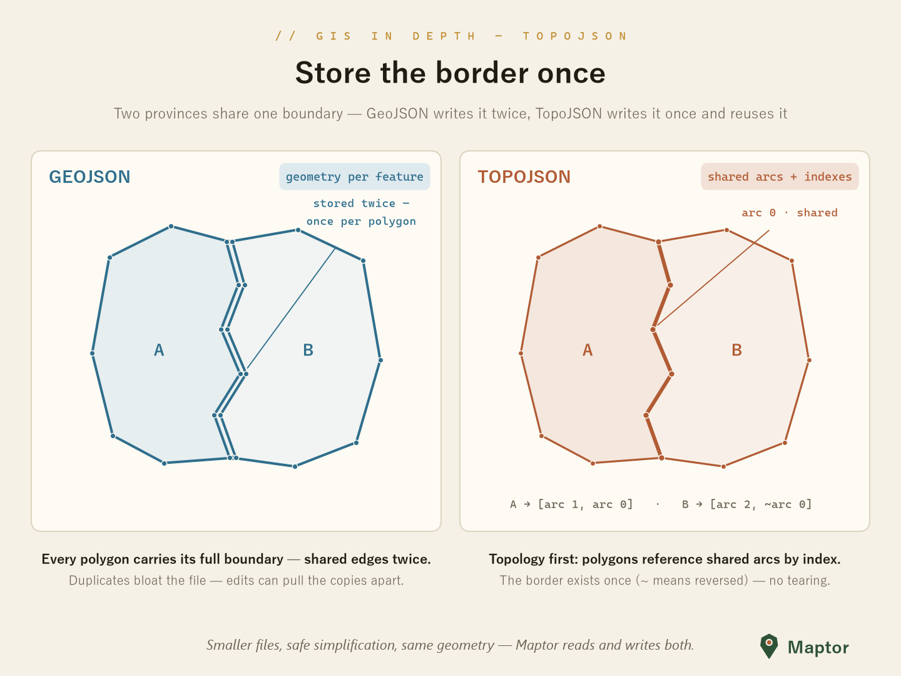

# TopoJSON

A .NET Standard implementation of TopoJSON — a GeoJSON extension that encodes topology as shared line segments (**arcs**) to reduce redundancy and file size. Supports reading, writing, and conversion to/from the library's `Feature<Point>` types.

## Supported capabilities

| Capability | Supported |
|---|---|
| Read | Yes — `TopoJson.Parse` / `ReadFromFileAsync`, `TopoJson.ToFeature` |
| Write | Yes — `TopoJson.WriteToFileAsync` / `Serialize`, `TopoJsonConverter.FromFeatures` |
| Quantization | Yes — optional, on write (`quantize`, `quantizationFactor`) |
| Z / M coordinates | No — 2D only |

Geometry types: `Point`, `MultiPoint`, `LineString`, `MultiLineString`, `Polygon`, `MultiPolygon`, and `GeometryCollection`. Feature properties are preserved and read back as .NET values. Writing a list of features produces a single `GeometryCollection` object (the shape Power BI's Shape Map visual expects).

## What is TopoJSON?

Instead of storing each geometry's coordinates independently, TopoJSON stitches geometries together from shared arcs. Shared boundaries are stored once, which typically produces smaller files than the equivalent GeoJSON.

<p align="center">
  
</p>

## Usage

All types live in `IRI.Maptor.Sta.Spatial.IO.TopoJson`.

### Reading

```csharp
using IRI.Maptor.Sta.Spatial.IO.TopoJson;

// From file (async) or from a string
TopoJsonTopology topology = await TopoJson.ReadFromFileAsync("map.topojson");
TopoJsonTopology fromString = TopoJson.Parse(File.ReadAllText("map.topojson"));

// Convert to features (keyed by object name); properties come back as typed .NET values
Dictionary<string, Feature<Point>> features = TopoJson.ToFeature(topology, srid: 4326);
```

### Writing

Writing a list of features groups them into a single `GeometryCollection`.

```csharp
using IRI.Maptor.Sta.Common.Primitives;
using IRI.Maptor.Sta.Spatial.Primitives;

var features = new List<Feature<Point>>();
// ... populate features (each with a Geometry<Point> and an attributes dictionary)

await TopoJson.WriteToFileAsync(
    features,
    "output.topojson",
    quantize: true,
    quantizationFactor: 10000,
    collectionName: "regions");
```

You can also build a topology yourself and write or serialize it separately:

```csharp
TopoJsonTopology topology = TopoJsonConverter.FromFeatures(features, quantize: true, quantizationFactor: 10000);

await TopoJson.WriteToFileAsync(topology, "map.topojson");
string json = TopoJson.Serialize(topology, indented: false);
```

### Quantization

Quantization snaps coordinates to an integer grid before delta-encoding arcs, trading precision for size. A higher factor keeps more precision; `quantize: false` writes exact (rounded to integer) coordinates.

```csharp
var high = TopoJsonConverter.FromFeatures(features, quantize: true, quantizationFactor: 1_000_000);
var low  = TopoJsonConverter.FromFeatures(features, quantize: true, quantizationFactor: 10_000);
var none = TopoJsonConverter.FromFeatures(features, quantize: false);
```

### Inspecting a topology

```csharp
var topology = await TopoJson.ReadFromFileAsync("map.topojson");

Console.WriteLine($"Arcs: {topology.Arcs.Count}, Objects: {topology.Objects.Count}");

if (topology.Transform is { } t)
    Console.WriteLine($"Scale: [{t.Scale[0]}, {t.Scale[1]}]  Translate: [{t.Translate[0]}, {t.Translate[1]}]");

if (topology.BBox != null)
    Console.WriteLine($"BBox: [{string.Join(", ", topology.BBox)}]");
```

## Format details

| Aspect | TopoJSON in Maptor |
|--------|--------------------|
| **Coordinate system** | TopoJSON follows GeoJSON's WGS 84 convention but stores positions as (optionally quantized) numbers and carries no CRS field. Maptor uses `srid` (default `4326`) on read and does not reproject. |
| **Z / M** | 2D only — Z and M are ignored. |
| **Polygon rings** | Rings are closed on encode (first vertex repeated) and un-closed on decode. Winding is preserved as-is; the TopoJSON exterior-CW / hole-CCW convention is **not** enforced. |
| **Serialization** | System.Text.Json. Deserialize: `TopoJson.Parse`, `TopoJson.ReadFromFileAsync`. Serialize: `TopoJson.Serialize`, `TopoJson.WriteToFileAsync`. |
| **Specification** | [TopoJSON Specification](https://github.com/topojson/topojson-specification) |

## Limitations

- Arcs use delta encoding; negative arc indices indicate a reversed direction. Points and MultiPoints are stored as absolute coordinates (no arcs).
- Quantization is lossy; without quantization, coordinates are rounded to integers when no transform is applied.
- Only 2D coordinates are handled — `Z` and `M` are ignored.
- Encoding accepts `Feature<Point>` collections; encoding a top-level `GeometryCollection` geometry is not supported.
- Arc deduplication matches arcs by endpoints and point count rather than performing full topological shared-arc extraction.

---
[Back to IRI.Maptor.Sta.Spatial](../../README.md)
