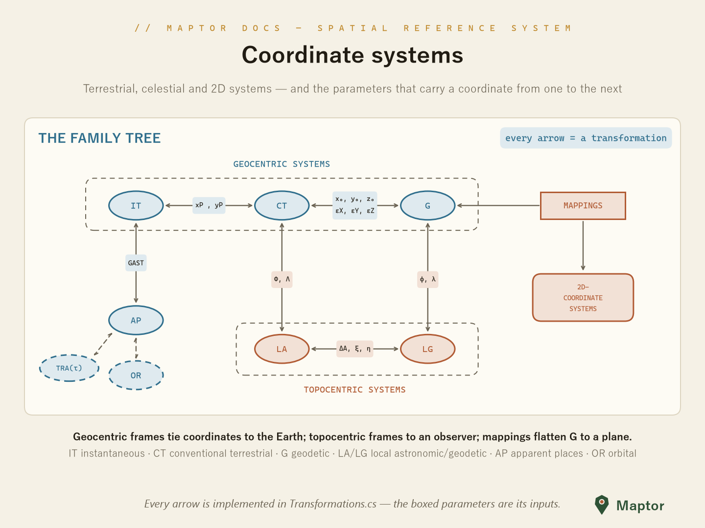

# Coordinate systems

This folder implements the coordinate systems used in geodesy, following the classical classification below:

<p align="center">
  
</p>

*Fig. 1: Relationship between geocentric, topocentric, and 2D coordinate systems*

- **Geocentric systems** (origin at the Earth's center):
  - **IT** — Instantaneous Terrestrial: tied to the true (instantaneous) rotation axis; related to CT through polar motion (x_P, y_P)
  - **CT** — Conventional (Average) Terrestrial: the Earth-fixed frame the others are referred to
  - **G** — Geodetic: latitude φ, longitude λ, height h on a reference ellipsoid; related to CT by the datum parameters (x₀, y₀, z₀, ε_X, ε_Y, ε_Z)
- **Topocentric systems** (origin at an observer on the surface):
  - **LA** — Local Astronomic: aligned with the plumb line (astronomical Φ, Λ)
  - **LG** — Local Geodetic: aligned with the ellipsoid normal (φ, λ); LA ↔ LG differ by the deflection of the vertical (ξ, η) and azimuth correction ΔA
- **Celestial / orbital systems**: **AP** — Apparent Places (related to IT through GAST), **OR** — Orbital
- **Mappings** take geodetic coordinates to **2D coordinate systems** — implemented in [`MapProjections`](../MapProjections/README.md)

## Systems in this folder

Each subfolder follows the same four-file pattern: the coordinate-system class, a strongly-typed `…Point` class, and their two interfaces. Points are generic over measurement units (e.g. `Meter`/`Degree`) from `IRI.Maptor.Sta.Metrics`.

| Folder | Coordinates | Used for |
|--------|-------------|----------|
| `Cartesian2D` | X, Y (`LinearUnit`) | Planar/projected coordinates |
| `Cartesian3D` | X, Y, Z (`LinearUnit`) | Geocentric frames (CT, IT) and datum shifts |
| `Polar` | Radius, Angle | 2D polar coordinates |
| `Curvilinear.Spherical` | Radius, HorizontalAngle, VerticalAngle | Spherical approximations, astronomy |
| `Curvilinear.Ellipsoidal` | HorizontalAngle, VerticalAngle + `Datum` | Angular coordinates on a reference ellipsoid |
| `Curvilinear.Ellipsoidal/Curvilinear.Astronomical` | HorizontalAngle, VerticalAngle | Astronomical (plumb-line) coordinates — LA, AP, HA |
| `Curvilinear.Geodetic` | Latitude, Longitude, Height + `Datum` | **The** geodetic system (G) — lat/lon/height on an ellipsoid |

## Basic usage

`GeodeticPoint<TLinear, TAngular>` is the workhorse: a φ/λ/h position bound to a datum ([`Ellipsoids`](../Models/README.md)), convertible to geocentric Cartesian:

```csharp
using IRI.Maptor.Sta.Metrics;
using IRI.Maptor.Sta.SpatialReferenceSystem;

var point = new GeodeticPoint<Meter, Degree>(
    Ellipsoids.WGS84,
    new Meter(0),                // ellipsoidal height
    new Degree(51.123456),       // longitude
    new Degree(35.123456));      // latitude

var cartesian = point.ToCartesian<Meter>();   // geocentric X, Y, Z
```

## Converting between systems

The static [`Transformations`](../Transformations.cs) class implements the arrows of Fig. 1:

| Conversion | Methods |
|------------|---------|
| CT ↔ IT | `AverageToInstantaneous` / `InstantaneousToAverage` |
| CT ↔ G | `AverageToGeodetic` / `GeodeticToAverage` |
| G1 ↔ G2 (datum change) | `ChangeDatum` |
| CT ↔ LA | `AverageToLocalAstronomic` / `LocalAstronomicToAverage` |
| G ↔ LG | `GeodeticToLocalGeodetic` / `LocalGeodeticToGeodetic` |
| LA ↔ LG | `LocalAstronomicToLocalGeodetic` / `LocalGeodeticToLocalAstronomic` |
| LA ↔ HA | `LocalAstronomicToHorizontalAngle` / `HorizontalAngleToLocalAstronomic` |
| HA ↔ AP | `HorizontalAngleToApparentPlace` / `ApparentPlaceToHorizontalAngle` |
| IT ↔ AP | `InstantaneousToApparentPlace` / `ApparentPlaceToInstantaneous` |
| OR ↔ AP | `OrbitalToApparentPlace` / `ApparentPlaceToOrbital` |

---

[Back to IRI.Maptor.Sta.SpatialReferenceSystem](../README.md)
