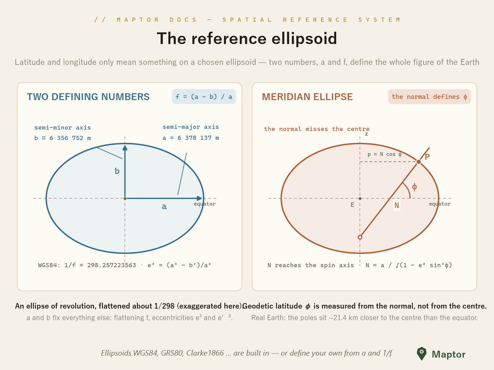
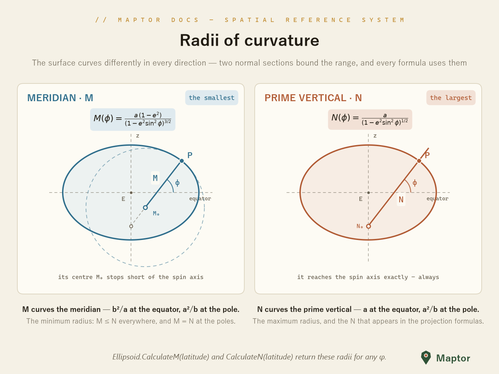

# 🌏 Models — Reference Ellipsoids & Horizontal Datums

<p align="center">
  
</p>

A latitude/longitude pair means nothing on its own — it is always measured **on a chosen reference ellipsoid**: an ellipse of revolution that approximates the figure of the Earth. Two numbers pin the shape down: the **semi-major axis `a`** and the **flattening `f = (a − b) / a`** (usually given as `1/f`). Everything else — semi-minor axis `b`, first/second eccentricity `e²`, `e′²`, and the radii of curvature `N` (prime vertical) and `M` (meridian) — follows from them.

## ✅ `Ellipsoid<TLinear, TAngular>`

[`Ellipsoid.cs`](Ellipsoid.cs) is a generic struct (typed by linear unit, e.g. `Meter`, and angular unit, e.g. `Degree`) implementing [`IEllipsoid`](IEllipsoid.cs). It exposes:

- **Geometry** — `SemiMajorAxis`, `SemiMinorAxis`, `Flattening`, `InverseFlattening`, `FirstEccentricity`, `SecondEccentricity`
- **Curvature** — `CalculateN(latitude)` (prime vertical) and `CalculateM(latitude)` (meridian) — see below
- **Datum definition** — `DatumTranslation` (a `Cartesian3DPoint` shift of the ellipsoid center) and `DatumMisalignment` (an [`OrientationParameter`](OrientationParameter.cs): rotations ω, φ, κ), which position a regional datum relative to the geocentric frame
- **Identity** — `Name`, `EsriName`, `Srid` (EPSG code)

## ✅ Radii of curvature — M and N

<p align="center">
  
</p>

Unlike a sphere, an ellipsoid curves by a different amount in every direction at a given point. Two **normal sections** bound the range, and together they carry almost all of the geodetic math:

| | Section | Formula | At the equator | At the pole |
|---|---------|---------|----------------|-------------|
| **M** | along the meridian — the **minimum** radius | M(φ) = a(1 − e²) / (1 − e² sin²φ)^{3/2} | b²/a | a²/b |
| **N** | along the prime vertical (east–west) — the **maximum** radius | N(φ) = a / (1 − e² sin²φ)^{1/2} | a | a²/b |

M ≤ N everywhere, and the two become equal at the poles. Geometrically, **N is the length of the surface normal from the point down to the spin axis** — it reaches the axis exactly — while **M's centre of curvature stops short of it**. N is also the quantity that appears in the geodetic→Cartesian conversion and in the Transverse Mercator / UTM series.

```csharp
var wgs84 = Ellipsoids.WGS84;

LinearUnit n = wgs84.CalculateN(new Degree(35.689));  // prime vertical radius
LinearUnit m = wgs84.CalculateM(new Degree(35.689));  // meridian radius
double meters = n.Value;                              // ≈ 6 385 415 m

// CalculateN also has a plain-double overload (latitude in degrees)
double nAtLat = wgs84.CalculateN(35.689);
```

## ✅ Predefined ellipsoids: `Ellipsoids`

[`Ellipsoids.cs`](Ellipsoids.cs) provides ready-made instances (`Ellipsoid<Meter, Degree>`). Notable ones:

| Property | a (m) | 1/f | EPSG |
|----------|-------|-----|------|
| `Ellipsoids.WGS84` | 6 378 137.0 | 298.257223563 | 4326 |
| `Ellipsoids.GRS80` | 6 378 137.0 | 298.257222101 | 4019 |
| `Ellipsoids.WGS72` | 6 378 135.0 | 298.26 | 4322 |
| `Ellipsoids.International1924` (Hayford) | 6 378 388.0 | 297 | 7022 |
| `Ellipsoids.Clarke1866` | 6 378 206.4 | 294.9786982 | 7008 |
| `Ellipsoids.Clarke1880Rgs` | 6 378 249.145 | 293.465 | 7012 |
| `Ellipsoids.Bessel1841` | 6 377 397.155 | 299.1528128 | 7004 |
| `Ellipsoids.Airy1830` | 6 377 563.396 | 299.3249646 | 7001 |
| `Ellipsoids.Sphere` | 6 378 137.0 | ∞ (no flattening) | — |

…plus regional datums carrying a translation toward WGS84, e.g. `Ellipsoids.FD58` (Final Datum 1958, used in Iran's oil industry) and `Ellipsoids.NahrawanIraq`.

`Ellipsoids.WGS84` is a cached singleton; treat it as the default datum throughout the library.

## 🚀 Custom ellipsoid

```csharp
using IRI.Maptor.Sta.Metrics;
using IRI.Maptor.Sta.SpatialReferenceSystem;
using IRI.Maptor.Sta.SpatialReferenceSystem.Models;

// simple: name, semi-major axis, 1/f, srid
var hayford = new Ellipsoid<Meter, Degree>("International 1924", new Meter(6378388.0), 297, 7022);

// full datum definition: with translation + orientation relative to the geocentric frame
var fd58 = new Ellipsoid<Meter, Degree>("D_FD_1958", new Meter(6378249.145), 293.465,
    new Cartesian3DPoint<Meter>(new Meter(-241.54), new Meter(-163.64), new Meter(396.06)),
    new OrientationParameter(new Degree(), new Degree(), new Degree()),
    4132);
```

To transform geodetic coordinates between two datums (G1 ↔ G2), use `Transformations.ChangeDatum(...)` from [`Transformations.cs`](../Transformations.cs).

---

📖 Back to the [project README](../README.md) · projections that consume these datums are documented in [MapProjections](../MapProjections/README.md).
